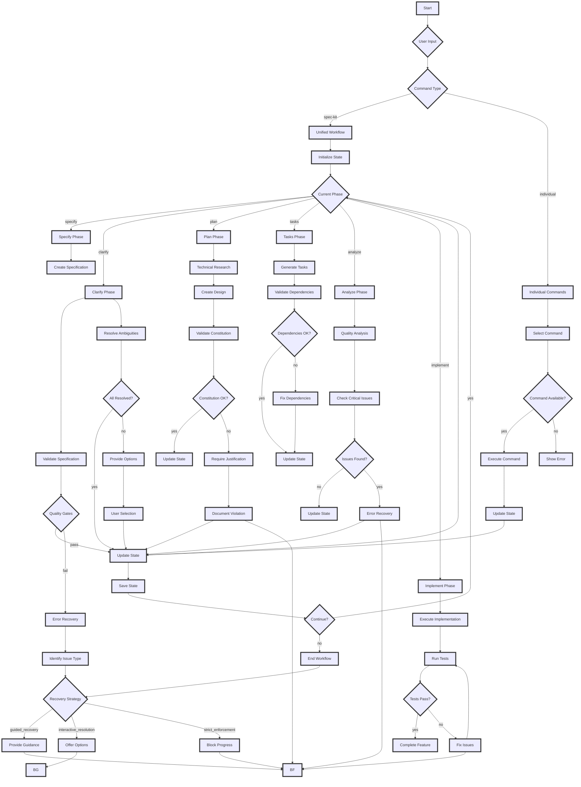

# Spec-Kit Mode Flowchart

## Phase Descriptions

### Specify Phase
- **Purpose**: Transform user idea into structured specification
- **Input**: Feature description from user
- **Output**: `specs/[feature]/spec.md`
- **Validation**: No implementation details, measurable success criteria, complete user stories

### Clarify Phase
- **Purpose**: Resolve ambiguities and refine requirements
- **Input**: Specification with potential ambiguities
- **Output**: Updated specification with clarifications
- **Validation**: Maximum 3 ambiguities remaining, all critical questions answered

### Plan Phase
- **Purpose**: Create technical implementation plan
- **Input**: Clarified specification
- **Output**: `specs/[feature]/plan.md` and design artifacts
- **Validation**: Constitution compliance, technical decisions documented, research complete

### Tasks Phase
- **Purpose**: Break down implementation into executable tasks
- **Input**: Implementation plan and specification
- **Output**: `specs/[feature]/tasks.md`
- **Validation**: User story coverage complete, dependency graph valid, MVP tasks identified

### Analyze Phase
- **Purpose**: Quality analysis and validation
- **Input**: Task breakdown and implementation plan
- **Output**: Analysis report and recommendations
- **Validation**: No critical issues, coverage adequate, security reviewed

### Implement Phase
- **Purpose**: Execute the implementation plan
- **Input**: Validated task breakdown
- **Output**: Working feature implementation
- **Validation**: Tests pass, specification met, quality checks passed

## Error Handling Paths

### Missing Prerequisites
- Identify missing required inputs
- Provide step-by-step recovery instructions
- Offer to run missing phases automatically

### Quality Gate Failures
- Present specific issues found
- Offer fix suggestions
- Provide override options with justification
- Allow return to previous phase

### Constitution Violations
- Block progress until resolved
- Require explicit justification
- Document violation for review

### Script Execution Failures
- Log detailed error information
- Attempt fallback methods
- Provide manual workarounds

## State Management

The workflow maintains a JSON state file (`.specify/workflow-state.json`) that tracks:

- Current phase
- Completed phases
- Validation status
- Generated artifacts
- Start and end times

This state is preserved between phase transitions and enables resuming work at any point.