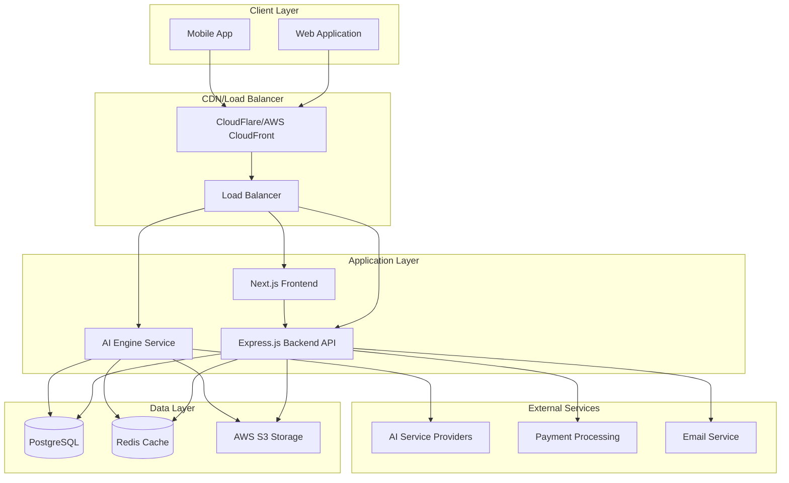
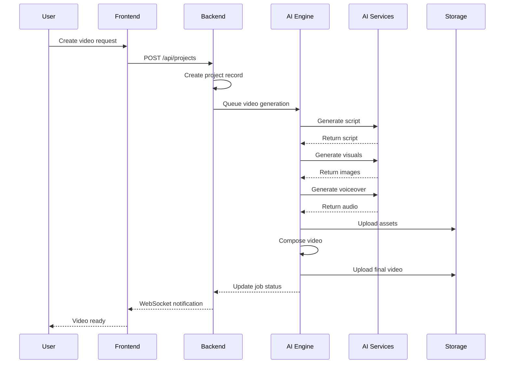
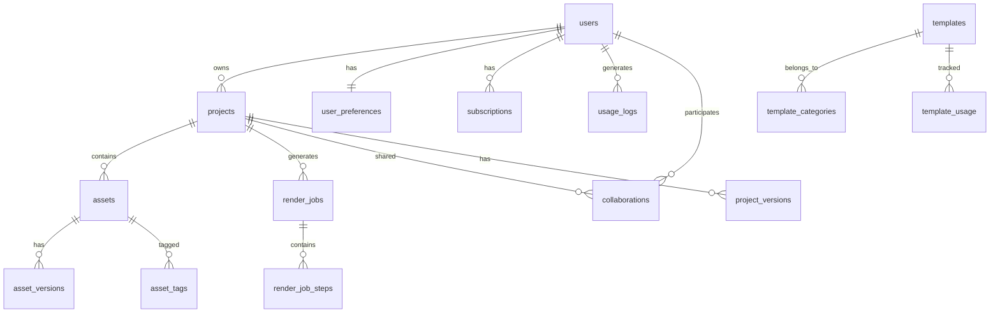
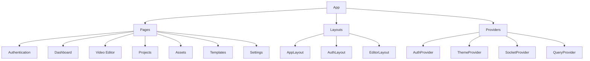
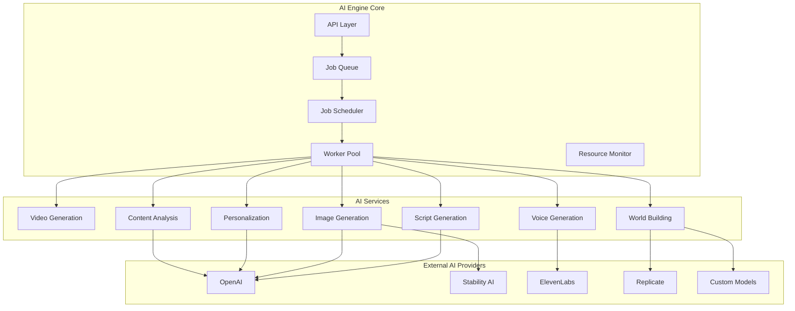
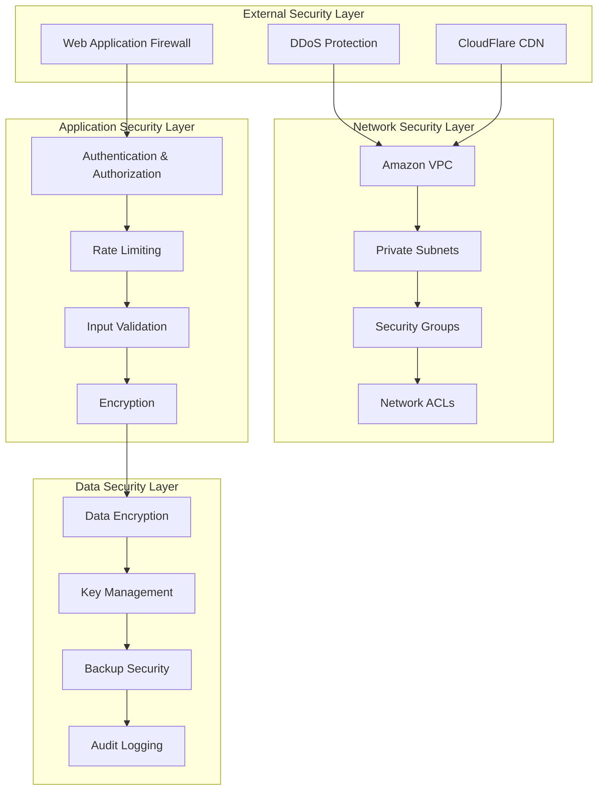

# AI Video Creation System - Architecture Document

## Table of Contents

1. [Executive Summary](#executive-summary)
2. [System Overview](#system-overview)
3. [Architecture Principles](#architecture-principles)
4. [System Architecture](#system-architecture)
5. [Database Design](#database-design)
6. [API Design](#api-design)
7. [Frontend Architecture](#frontend-architecture)
8. [AI Engine Architecture](#ai-engine-architecture)
9. [Security Architecture](#security-architecture)
10. [Deployment Architecture](#deployment-architecture)
11. [Development Roadmap](#development-roadmap)
12. [Technical Considerations](#technical-considerations)
13. [Conclusion](#conclusion)

## Executive Summary

The AI Video Creation System is a comprehensive platform that enables users to create professional-quality videos using artificial intelligence. The system combines advanced AI technologies with an intuitive user interface to democratize video creation.

### Key Features
- AI-powered video generation from text prompts
- 3D world building and environment creation
- Personalized content recommendations
- Real-time collaboration tools
- Template-based video creation
- Multi-platform export capabilities
- Subscription-based monetization

### Technical Highlights
- Microservices architecture for scalability
- Multi-cloud deployment strategy
- Advanced AI model integration
- Real-time collaboration via WebSockets
- Comprehensive security measures
- Auto-scaling infrastructure

## System Overview

### High-Level Architecture

The AI Video Creation System follows a three-tier microservices architecture:



### Core Components

#### 1. Frontend Application
- **Technology**: Next.js 14, React 18, TypeScript
- **Styling**: Tailwind CSS
- **State Management**: Zustand, React Query
- **Real-time**: WebSocket integration
- **3D Rendering**: Three.js, React Three Fiber

#### 2. Backend API
- **Technology**: Node.js, Express.js
- **Authentication**: JWT with refresh tokens
- **Database**: PostgreSQL with connection pooling
- **Caching**: Redis for sessions and cache
- **File Storage**: AWS S3 integration

#### 3. AI Engine
- **Technology**: Node.js, Python for ML models
- **AI Integration**: OpenAI, Stability AI, ElevenLabs, Replicate
- **Processing**: FFmpeg for video composition
- **Queue System**: Redis-based job queue
- **Worker Pool**: Scalable worker threads

## Architecture Principles

### 1. Scalability
- Horizontal scaling with container orchestration
- Auto-scaling based on load metrics
- Microservices for independent scaling
- Caching at multiple levels

### 2. Reliability
- High availability with multi-AZ deployment
- Graceful degradation for service failures
- Comprehensive error handling and logging
- Automated backup and disaster recovery

### 3. Security
- Defense-in-depth security approach
- Zero-trust network architecture
- End-to-end encryption
- Regular security audits and penetration testing

### 4. Performance
- Optimized database queries with proper indexing
- CDN for static asset delivery
- Lazy loading and code splitting
- Efficient AI model usage with caching

### 5. Maintainability
- Clean code architecture with separation of concerns
- Comprehensive documentation
- Automated testing at all levels
- CI/CD pipeline for continuous integration

## System Architecture

### Microservices Design

#### Frontend Service
```typescript
interface FrontendService {
  // User Interface
  renderPages(): React.ComponentType;
  handleRouting(): void;
  manageState(): StateManager;
  
  // Real-time Features
  connectWebSocket(): WebSocket;
  handleCollaboration(): CollaborationManager;
  
  // Asset Management
  uploadFiles(): FileUploader;
  previewAssets(): AssetPreviewer;
}
```

#### Backend API Service
```typescript
interface BackendAPIService {
  // Authentication
  authenticateUser(): Promise<AuthResult>;
  authorizeRequest(): Promise<boolean>;
  manageSessions(): SessionManager;
  
  // Business Logic
  manageProjects(): ProjectManager;
  manageAssets(): AssetManager;
  processPayments(): PaymentProcessor;
  
  // Real-time
  handleWebSockets(): WebSocketHandler;
  broadcastEvents(): EventBroadcaster;
}
```

#### AI Engine Service
```typescript
interface AIEngineService {
  // Video Generation
  generateVideo(): Promise<VideoResult>;
  processQueue(): JobProcessor;
  manageWorkers(): WorkerManager;
  
  // AI Model Integration
  integrateModels(): ModelIntegrator;
  optimizePerformance(): PerformanceOptimizer;
  
  // Content Analysis
  analyzeContent(): ContentAnalyzer;
  personalizeContent(): PersonalizationEngine;
}
```

### Data Flow Architecture



## Database Design

### Enhanced Schema Overview

The database uses PostgreSQL with the following key enhancements:

#### Core Tables
- **users**: User accounts with authentication and preferences
- **projects**: Video projects with metadata and settings
- **assets**: Media files with versioning and tagging
- **render_jobs**: Video generation jobs with progress tracking
- **templates**: Reusable video templates with categories

#### Enhanced Tables
- **project_versions**: Version history for projects
- **asset_versions**: Version history for assets
- **collaborations**: Real-time collaboration management
- **subscriptions**: Subscription tiers and billing
- **analytics**: User behavior and system metrics

#### Performance Optimizations
- **Indexing Strategy**: Composite indexes for common queries
- **Partitioning**: Time-based partitioning for large tables
- **Data Retention**: Automated cleanup of old data
- **Connection Pooling**: Optimized database connections

### Key Relationships



## API Design

### RESTful API Structure

The API follows RESTful principles with consistent patterns:

#### Authentication Endpoints
```
POST   /api/auth/register          - User registration
POST   /api/auth/login             - User login
POST   /api/auth/logout            - User logout
POST   /api/auth/refresh           - Refresh JWT token
POST   /api/auth/verify-email      - Email verification
POST   /api/auth/forgot-password   - Request password reset
POST   /api/auth/reset-password    - Reset password
```

#### Project Management
```
GET    /api/projects               - List projects (paginated)
POST   /api/projects               - Create new project
GET    /api/projects/:id           - Get project details
PUT    /api/projects/:id           - Update project
DELETE /api/projects/:id           - Delete project
POST   /api/projects/:id/duplicate - Duplicate project
```

#### Asset Management
```
GET    /api/assets                 - List assets (filtered)
POST   /api/assets                 - Upload asset
GET    /api/assets/:id             - Get asset details
PUT    /api/assets/:id             - Update asset metadata
DELETE /api/assets/:id             - Delete asset
```

#### AI Generation
```
POST   /api/ai/generate/script      - Generate video script
POST   /api/ai/generate/images      - Generate images
POST   /api/ai/generate/voice       - Generate voiceover
POST   /api/ai/generate/world       - Generate 3D world
POST   /api/ai/analyze/content       - Analyze content
POST   /api/ai/personalize          - Get personalized recommendations
```

### Response Format Standards

#### Success Response
```json
{
  "status": "success",
  "message": "Operation completed successfully",
  "data": {
    // Response data
  },
  "meta": {
    "timestamp": "2024-01-01T00:00:00Z",
    "requestId": "uuid",
    "pagination": {
      "page": 1,
      "limit": 10,
      "total": 100,
      "totalPages": 10
    }
  }
}
```

#### Error Response
```json
{
  "status": "error",
  "message": "Error description",
  "error": {
    "code": "ERROR_CODE",
    "details": "Detailed error information",
    "field": "field_name"
  },
  "meta": {
    "timestamp": "2024-01-01T00:00:00Z",
    "requestId": "uuid"
  }
}
```

### WebSocket Events

#### Real-time Collaboration
```javascript
// Client to Server
'join-project'      // Join project collaboration
'leave-project'     // Leave project collaboration
'cursor-move'      // Cursor position update
'selection-change'  // Asset selection change
'edit-operation'   // Edit operation

// Server to Client
'user-joined'       // User joined project
'user-left'         // User left project
'cursor-update'     // Cursor position update
'selection-update'  // Selection change
'edit-applied'      // Edit applied by another user
```

## Frontend Architecture

### Component Hierarchy

The frontend follows a modular, component-based architecture:



### State Management

#### Global State (Zustand)
```typescript
interface AppState {
  // User state
  user: User | null;
  isAuthenticated: boolean;
  
  // UI state
  theme: 'light' | 'dark';
  sidebarOpen: boolean;
  notifications: Notification[];
  
  // Editor state
  currentProject: Project | null;
  selectedAssets: Asset[];
  timeline: TimelineState;
}
```

#### Server State (React Query)
```typescript
const useProjects = () => {
  return useQuery(['projects'], () => projectAPI.getProjects());
};

const useProject = (id: string) => {
  return useQuery(['project', id], () => projectAPI.getProject(id));
};
```

### Key Components

#### Video Editor
```typescript
interface VideoEditorProps {
  project: Project;
  onSave: (project: Project) => void;
  onPreview: () => void;
  onExport: (settings: ExportSettings) => void;
}

// Sub-components
- Timeline: Track-based editing interface
- Canvas: Visual preview and editing area
- Controls: Playback and editing controls
- Properties: Asset property panel
- Layers: Layer management panel
```

#### Asset Library
```typescript
interface AssetLibraryProps {
  assets: Asset[];
  selectedAssets: Asset[];
  filters: AssetFilters;
  onAssetSelect: (asset: Asset) => void;
  onAssetDelete: (asset: Asset) => void;
  onFilterChange: (filters: AssetFilters) => void;
  onUpload: (files: File[]) => void;
}
```

## AI Engine Architecture

### AI Service Architecture

The AI Engine is a specialized microservice for AI-powered operations:



### Video Generation Pipeline

```typescript
interface VideoGenerationService {
  // Main generation pipeline
  generateVideo(params: VideoGenerationParams): Promise<VideoGenerationJob>;
  
  // Pipeline stages
  generateScript(prompt: string, settings: ScriptSettings): Promise<VideoScript>;
  generateScenes(script: VideoScript, settings: SceneSettings): Promise<VideoScene[]>;
  generateAssets(scenes: VideoScene[], settings: AssetSettings): Promise<VideoAssets>;
  generateVoiceover(script: VideoScript, settings: VoiceSettings): Promise<AudioAsset>;
  composeVideo(elements: VideoElements, settings: CompositionSettings): Promise<VideoAsset>;
  
  // Job management
  getJobStatus(jobId: string): Promise<JobStatus>;
  cancelJob(jobId: string): Promise<boolean>;
  retryJob(jobId: string): Promise<VideoGenerationJob>;
}
```

### Job Queue Management

```typescript
interface JobQueue {
  // Queue management
  enqueue(job: Job): Promise<string>;
  dequeue(queue: string): Promise<Job | null>;
  prioritize(jobId: string, priority: JobPriority): Promise<void>;
  
  // Job status
  getJobStatus(jobId: string): Promise<JobStatus>;
  updateJobStatus(jobId: string, status: JobStatus, progress?: number): Promise<void>;
  
  // Queue monitoring
  getQueueStats(queue: string): Promise<QueueStats>;
  getActiveJobs(): Promise<Job[]>;
  getFailedJobs(): Promise<Job[]>;
}
```

### Worker Pool Architecture

```typescript
interface WorkerPool {
  // Pool management
  initialize(config: WorkerPoolConfig): Promise<void>;
  shutdown(): Promise<void>;
  
  // Worker lifecycle
  createWorker(type: WorkerType): Promise<Worker>;
  destroyWorker(workerId: string): Promise<void>;
  
  // Job execution
  assignJob(job: Job): Promise<void>;
  executeJob(job: Job): Promise<JobResult>;
  
  // Resource management
  getResourceUsage(): Promise<ResourceUsage>;
  scaleWorkers(targetCount: number): Promise<void>;
}
```

## Security Architecture

### Multi-Layer Security Approach



### Authentication & Authorization

#### JWT Security Implementation
```typescript
interface JWTSecurityConfig {
  accessTokenExpiry: string; // "15m"
  refreshTokenExpiry: string; // "7d"
  issuer: string;
  audience: string;
  keyRotationInterval: number; // 30 days
  maxKeyAge: number; // 90 days
}

class SecureJWTService {
  async generateToken(payload: JWTPayload): Promise<string>;
  async verifyToken(token: string): Promise<JWTPayload>;
  async revokeToken(token: string): Promise<void>;
  async rotateKeys(): Promise<void>;
}
```

#### Role-Based Access Control (RBAC)
```typescript
interface Role {
  id: string;
  name: string;
  permissions: Permission[];
  hierarchy: number;
}

interface Permission {
  resource: string;
  actions: Action[];
  conditions?: Condition[];
}

class RBACService {
  async hasPermission(
    userId: string, 
    resource: string, 
    action: Action, 
    context?: any
  ): Promise<boolean>;
  
  async assignRole(userId: string, roleId: string): Promise<void>;
  async revokeRole(userId: string, roleId: string): Promise<void>;
}
```

### Data Protection

#### Encryption at Rest and in Transit
```typescript
interface EncryptionConfig {
  algorithm: string;
  keySize: number;
  ivSize: number;
  tagSize: number;
}

class EncryptionService {
  async encrypt(data: Buffer): Promise<EncryptedData>;
  async decrypt(encryptedData: EncryptedData): Promise<Buffer>;
  async generateDataKey(): Promise<DataKey>;
  async rotateKeys(): Promise<void>;
}
```

#### Input Validation & Sanitization
```typescript
class InputValidator {
  addRule(rule: ValidationRule): this;
  validate(input: any): ValidationResult;
  sanitize(input: string): string;
  validateType(value: any, type: string): boolean;
}
```

## Deployment Architecture

### Kubernetes-Based Infrastructure

The system uses Kubernetes for container orchestration and management:

#### Cluster Architecture
```yaml
# Production cluster configuration
apiVersion: v1
kind: Namespace
metadata:
  name: ai-video-system
  labels:
    name: ai-video-system
    environment: production
---
apiVersion: apps/v1
kind: Deployment
metadata:
  name: frontend
  namespace: ai-video-system
spec:
  replicas: 3
  selector:
    matchLabels:
      app: frontend
  template:
    metadata:
      labels:
        app: frontend
    spec:
      containers:
      - name: frontend
        image: ai-video-system/frontend:latest
        ports:
        - containerPort: 3000
        resources:
          requests:
            memory: "256Mi"
            cpu: "250m"
          limits:
            memory: "512Mi"
            cpu: "500m"
```

#### Auto-Scaling Configuration
```yaml
apiVersion: autoscaling/v2
kind: HorizontalPodAutoscaler
metadata:
  name: workers-hpa
  namespace: ai-video-system
spec:
  scaleTargetRef:
    apiVersion: apps/v1
    kind: Deployment
    name: workers
  minReplicas: 2
  maxReplicas: 10
  metrics:
  - type: Resource
    resource:
      name: cpu
      target:
        type: Utilization
        averageUtilization: 70
  - type: Resource
    resource:
      name: memory
      target:
        type: Utilization
        averageUtilization: 80
```

### Database Configuration

#### PostgreSQL (Amazon RDS)
```yaml
apiVersion: rds.services.k8s.aws/v1alpha1
kind: DBInstance
metadata:
  name: ai-video-system-db
  namespace: ai-video-system
spec:
  dbInstanceIdentifier: ai-video-system-db
  allocatedStorage: 100
  dbInstanceClass: db.r5.large
  engine: postgres
  engineVersion: "15.4"
  masterUsername: postgres
  storageType: gp2
  storageEncrypted: true
  multiAZ: true
  publiclyAccessible: false
```

#### Redis (Amazon ElastiCache)
```yaml
apiVersion: elasticache.services.k8s.aws/v1alpha1
kind: ReplicationGroup
metadata:
  name: ai-video-system-redis
  namespace: ai-video-system
spec:
  replicationGroupId: ai-video-system-redis
  nodeType: cache.r5.large
  numCacheClusters: 3
  engine: redis
  engineVersion: "7.0"
  atRestEncryptionEnabled: true
  transitEncryptionEnabled: true
  automaticFailoverEnabled: true
  multiAZEnabled: true
```

### CI/CD Pipeline

#### Automated Deployment Pipeline
```yaml
apiVersion: codepipeline.services.k8s.aws/v1alpha1
kind: Pipeline
metadata:
  name: ai-video-system-pipeline
  namespace: ai-video-system
spec:
  pipelineName: ai-video-system-pipeline
  stages:
  - name: Source
    actions:
    - name: SourceCode
      actionTypeId:
        category: Source
        owner: AWS
        provider: CodeCommit
        version: '1'
      configuration:
        RepositoryName: ai-video-system
        BranchName: main
  - name: Build
    actions:
    - name: BuildFrontend
      actionTypeId:
        category: Build
        owner: AWS
        provider: CodeBuild
        version: '1'
      configuration:
        ProjectName: ai-video-system-frontend
  - name: Deploy
    actions:
    - name: DeployToProduction
      actionTypeId:
        category: Deploy
        owner: AWS
        provider: CloudFormation
        version: '1'
      configuration:
        StackName: ai-video-system-production
```

## Development Roadmap

### Phase-Based Development Approach

The project is divided into 5 phases, each building upon the previous one:

#### Phase 1: Foundation (4 weeks)
- Core infrastructure setup
- Authentication system
- Basic UI framework
- Database implementation

#### Phase 2: Core Features (4 weeks)
- Project management
- Asset management
- Basic video editor
- File upload system

#### Phase 3: AI Integration (4 weeks)
- Script generation
- Image generation
- Voice generation
- Video composition

#### Phase 4: Advanced Features (4 weeks)
- World building
- Personalization
- Collaboration
- Templates system

#### Phase 5: Production Ready (4 weeks)
- Performance optimization
- Security hardening
- Monitoring & analytics
- Deployment & CI/CD

### Resource Allocation

#### Team Structure
- **Backend Developers:** 3
- **Frontend Developers:** 3
- **AI/ML Engineers:** 2
- **DevOps Engineers:** 2
- **UI/UX Designers:** 2
- **QA Engineers:** 2
- **Product Manager:** 1
- **Scrum Master:** 1

### Success Metrics

#### Technical Metrics
- **System Uptime:** >99.9%
- **Response Time:** <200ms for API calls
- **Video Generation Time:** <5 minutes for standard videos
- **Error Rate:** <0.1%

#### Business Metrics
- **User Registration:** 1000+ users in first month
- **Video Creation:** 500+ videos created in first month
- **User Retention:** >70% after 30 days
- **Customer Satisfaction:** >4.5/5 rating

## Technical Considerations

### Performance Optimization

#### Caching Strategy
- **Multi-level caching**: Memory, Redis, CDN
- **Cache warming**: Preload frequently accessed data
- **Cache invalidation**: Intelligent cache invalidation
- **Cache analytics**: Monitor cache hit rates

#### Database Optimization
- **Query optimization**: Proper indexing and query tuning
- **Connection pooling**: Efficient database connections
- **Read replicas**: Distribute read operations
- **Partitioning**: Time-based partitioning for large tables

#### Frontend Optimization
- **Code splitting**: Lazy load components and routes
- **Image optimization**: WebP format and responsive images
- **Bundle optimization**: Minimize JavaScript bundle size
- **Service workers**: Offline capabilities and caching

### Scalability Considerations

#### Horizontal Scaling
- **Container orchestration**: Kubernetes for auto-scaling
- **Load balancing**: Distribute traffic across instances
- **Database scaling**: Read replicas and sharding
- **CDN integration**: Global content delivery

#### Vertical Scaling
- **Resource monitoring**: Track CPU, memory, and disk usage
- **Performance profiling**: Identify bottlenecks
- **Resource allocation**: Optimize resource allocation
- **Capacity planning**: Plan for future growth

### Monitoring & Observability

#### Application Monitoring
- **Metrics collection**: Prometheus and Grafana
- **Log aggregation**: ELK stack or CloudWatch
- **Error tracking**: Sentry for error monitoring
- **Performance monitoring**: APM tools

#### Infrastructure Monitoring
- **Resource monitoring**: CPU, memory, disk, network
- **Container monitoring**: Kubernetes metrics
- **Database monitoring**: Query performance and connections
- **Network monitoring**: Latency and throughput

## Conclusion

The AI Video Creation System architecture is designed to be scalable, secure, and maintainable while providing a seamless user experience for AI-powered video creation. The microservices architecture ensures independent scaling and development of different components, while the comprehensive security measures protect user data and system integrity.

### Key Strengths

1. **Scalability**: Microservices architecture with auto-scaling capabilities
2. **Security**: Multi-layered security approach with encryption and access controls
3. **Performance**: Optimized database queries, caching, and CDN integration
4. **Maintainability**: Clean code architecture with comprehensive documentation
5. **User Experience**: Intuitive interface with real-time collaboration features

### Future Considerations

1. **AI Model Evolution**: Continuously integrate new and improved AI models
2. **Platform Expansion**: Support for additional platforms and formats
3. **Advanced Features**: Implement more sophisticated AI capabilities
4. **Global Expansion**: Multi-region deployment for global users
5. **Mobile Applications**: Native mobile apps for iOS and Android

This architecture provides a solid foundation for building a world-class AI video creation platform that can scale to meet growing user demands while maintaining high performance and security standards.