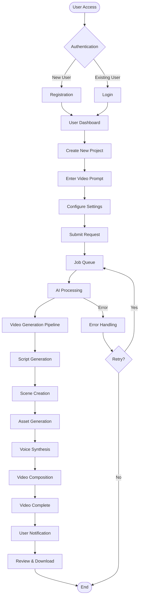
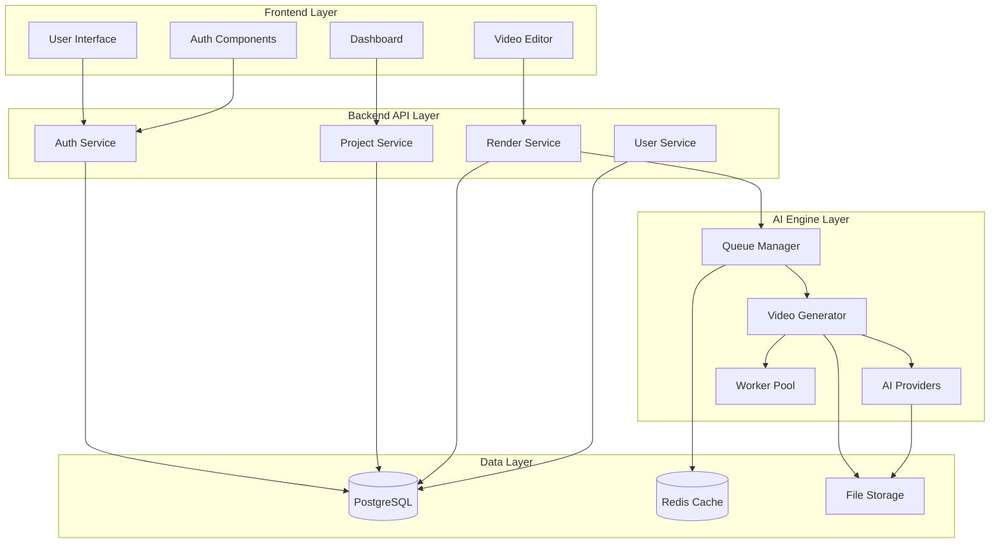
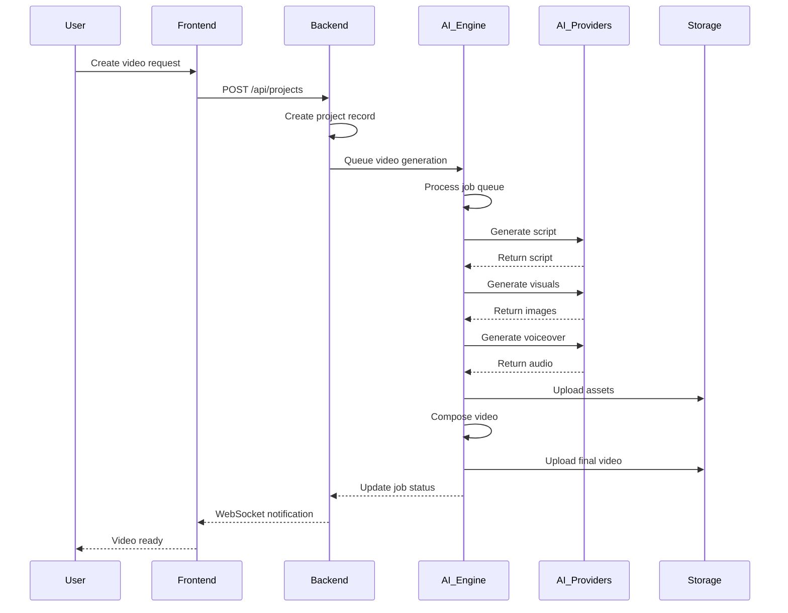
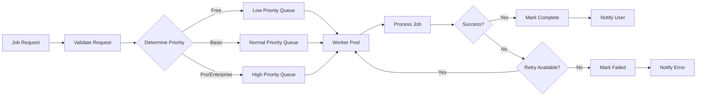
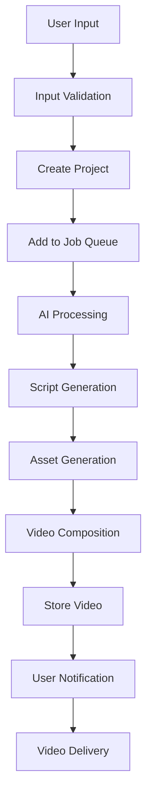
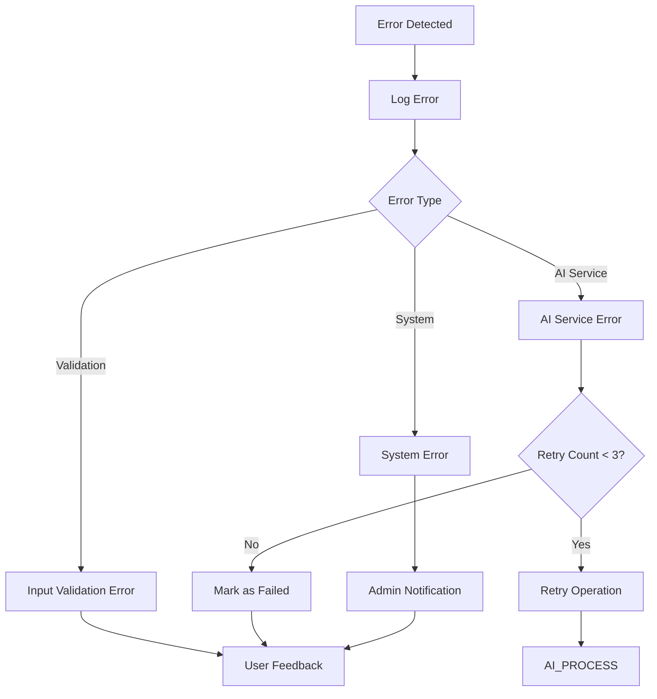
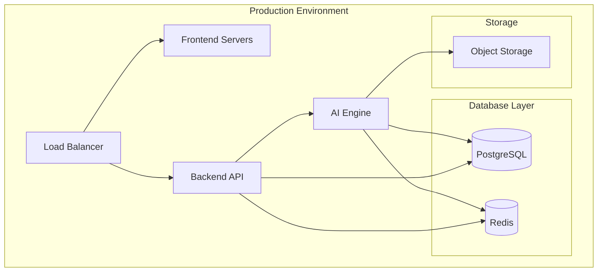

# AI Video System - MVP Flow Chart

## Overview

This document outlines the Minimum Viable Product (MVP) flow for the AI Video Creation System, focusing on the essential user journey and core system workflows needed to deliver a functional video creation experience.

## MVP User Journey Flow

## Core System Architecture Flow

## Video Generation Pipeline Flow

## Job Queue Management Flow

## MVP Feature Set

### Core Features (Must Have)
1. **User Authentication**
   - User registration
   - Login/logout
   - Session management

2. **Project Management**
   - Create new project
   - View project list
   - Basic project settings

3. **Video Generation**
   - Text-to-video prompt input
   - Basic generation settings
   - Job status tracking
   - Video preview and download

4. **Job Queue System**
   - Priority-based queuing
   - Progress tracking
   - Error handling

### Secondary Features (Nice to Have)
1. **Template System**
   - Pre-defined templates
   - Template customization

2. **Asset Management**
   - Upload custom assets
   - Asset library

3. **Collaboration**
   - Share projects
   - Basic collaboration

## Data Flow for MVP

## Error Handling Flow

## Performance Considerations for MVP

1. **Queue Management**
   - Limit concurrent jobs per user
   - Implement fair queue scheduling
   - Monitor queue health

2. **Resource Management**
   - Optimize AI provider usage
   - Implement caching strategies
   - Monitor resource utilization

3. **User Experience**
   - Provide progress indicators
   - Implement real-time notifications
   - Handle long-running operations gracefully

## Security Considerations for MVP

1. **Authentication**
   - JWT token management
   - Secure password handling
   - Session timeout

2. **API Security**
   - Rate limiting
   - Input validation
   - CORS configuration

3. **Data Protection**
   - Encrypt sensitive data
   - Secure file storage
   - User data isolation

## Deployment Architecture for MVP

## Success Metrics for MVP

1. **Technical Metrics**
   - System uptime > 95%
   - Video generation success rate > 80%
   - Average response time < 2 seconds

2. **User Metrics**
   - User registration completion rate > 70%
   - Video creation completion rate > 60%
   - User retention after 7 days > 40%

3. **Business Metrics**
   - Cost per video generation
   - User satisfaction score
   - Feature adoption rate

## Next Steps After MVP

1. **Phase 2 Enhancements**
   - Advanced video editing features
   - More AI provider integrations
   - Enhanced collaboration tools

2. **Phase 3 Features**
   - Mobile applications
   - Advanced analytics
   - Enterprise features

3. **Scaling Considerations**
   - Multi-region deployment
   - Advanced caching strategies
   - Performance optimization