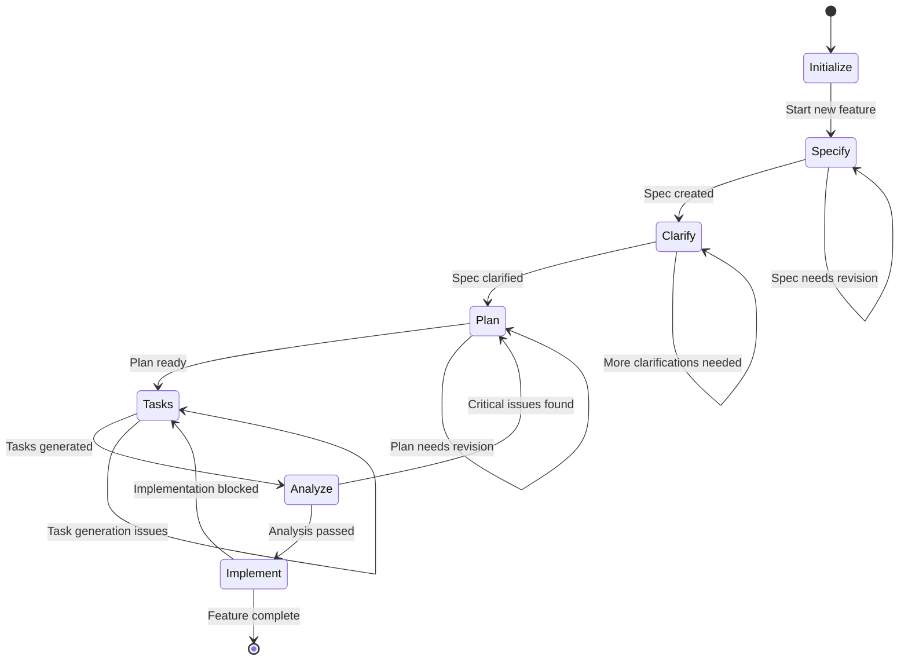

# Spec-Kit Integration Design: Unified Kilo Code Mode System

## Executive Summary

This document outlines the comprehensive integration approach for spec-kit as a unified Kilo Code mode system. The design creates a seamless spec-driven development experience that guides users through a sequential workflow while maintaining compatibility with existing individual command workflows.

## 1. Overall Architecture

### 1.1 Core Design Philosophy

The unified spec-kit mode follows a **guided sequential workflow** approach that orchestrates all individual spec-kit commands in a logical progression:

```
specify → clarify → plan → tasks → analyze → implement
```

This architecture provides:
- **Linear progression** through spec-driven development phases
- **Context preservation** between workflow stages
- **Intelligent validation** at each transition point
- **Fallback access** to individual commands when needed

### 1.2 System Components

```
┌─────────────────────────────────────────────────────────────┐
│                    Spec-Kit Mode                          │
├─────────────────────────────────────────────────────────────┤
│  Workflow Orchestrator                                     │
│  ├── State Management                                     │
│  ├── Progress Tracking                                    │
│  ├── Validation Engine                                    │
│  └── Context Preservation                                │
├─────────────────────────────────────────────────────────────┤
│  Command Layer (Existing Individual Workflows)            │
│  ├── speckit.specify.md                                 │
│  ├── speckit.clarify.md                                 │
│  ├── speckit.plan.md                                     │
│  ├── speckit.tasks.md                                    │
│  ├── speckit.analyze.md                                  │
│  ├── speckit.implement.md                                │
│  ├── speckit.checklist.md                                │
│  └── speckit.constitution.md                             │
├─────────────────────────────────────────────────────────────┤
│  Integration Layer                                         │
│  ├── Template Management                                  │
│  ├── Script Execution                                     │
│  ├── File System Operations                               │
│  └── Kilo Code Mode Interface                            │
└─────────────────────────────────────────────────────────────┘
```

## 2. Workflow Sequence and User Interaction Patterns

### 2.1 Sequential Workflow Design

The unified mode implements a **state machine** pattern with clear transitions:



### 2.2 User Interaction Flow

#### Phase 1: Feature Initialization
```
User: "I want to add user authentication to my web app"
System: 
- Creates feature branch (001-user-auth)
- Initializes spec structure
- Starts specify phase
```

#### Phase 2: Guided Progression
```
System: "Specification complete. Found 2 ambiguities that need clarification:"
- Presents targeted questions
- Updates spec with answers
- Automatically advances to planning phase
```

#### Phase 3: Continuous Validation
```
System: "Plan generated. Constitution check passed."
- Shows progress indicators
- Validates prerequisites before each phase
- Offers recommendations for next steps
```

### 2.3 Progress Tracking

The unified mode maintains a **workflow state file** (`.specify/workflow-state.json`):

```json
{
  "feature": "001-user-auth",
  "currentPhase": "plan",
  "completedPhases": ["specify", "clarify"],
  "validationStatus": {
    "spec": "passed",
    "clarify": "passed",
    "plan": "in_progress"
  },
  "artifacts": {
    "spec": "specs/001-user-auth/spec.md",
    "plan": "specs/001-user-auth/plan.md",
    "tasks": null
  }
}
```

## 3. Integration Points with Kilo Code Infrastructure

### 3.1 Mode Registration

The unified spec-kit mode integrates with Kilo Code's mode system through:

```yaml
# .kilocode/modes/spec-kit.yaml
name: "spec-kit"
description: "Comprehensive spec-driven development workflow"
entrypoint: ".kilocode/workflows/spec-kit-mode.md"
version: "1.0.0"
dependencies:
  - "temp-spec-kit"
  - ".kilocode/workflows/*"
```

### 3.2 Workflow Orchestration

The main mode workflow (`.kilocode/workflows/spec-kit-mode.md`) acts as the orchestrator:

```markdown
---
description: Unified spec-driven development workflow mode
---

## Workflow State Management

1. Load current workflow state from `.specify/workflow-state.json`
2. Determine appropriate phase based on state and user input
3. Execute corresponding individual command workflow
4. Update state and validate transition to next phase
5. Provide guidance for next steps

## Phase Transitions

Each phase transition includes:
- Prerequisite validation
- Artifact verification
- Quality gate checks
- User confirmation for major transitions
```

### 3.3 Script Integration

The unified mode leverages existing PowerShell scripts:

- **`create-new-feature.ps1`**: Feature initialization
- **`check-prerequisites.ps1`**: Phase validation
- **`setup-plan.ps1`**: Plan preparation
- **`update-agent-context.ps1`**: Context management

### 3.4 Template Management

Templates are centralized and version-controlled:

```
.specify/templates/
├── spec-template.md
├── plan-template.md
├── tasks-template.md
├── checklist-template.md
└── agent-file-template.md
```

## 4. File Structure and Organization

### 4.1 Unified Mode Structure

```
.kilocode/
├── modes/
│   └── spec-kit.yaml
├── workflows/
│   ├── spec-kit-mode.md          # Main orchestrator
│   ├── speckit.analyze.md       # Existing individual commands
│   ├── speckit.specify.md
│   ├── speckit.clarify.md
│   ├── speckit.plan.md
│   ├── speckit.tasks.md
│   ├── speckit.implement.md
│   ├── speckit.checklist.md
│   └── speckit.constitution.md
└── rules/
    └── spec-kit-integration.md   # Integration guidelines
```

### 4.2 Feature Structure

```
specs/[###-feature-name]/
├── spec.md                     # Feature specification
├── plan.md                     # Implementation plan
├── research.md                 # Research findings
├── data-model.md              # Data model
├── quickstart.md              # Quick start guide
├── tasks.md                   # Task breakdown
├── checklists/                # Quality checklists
│   ├── requirements.md
│   ├── ux.md
│   ├── security.md
│   └── test.md
├── contracts/                 # API contracts
│   ├── openapi.yaml
│   └── graphql.schema
└── workflow-state.json        # Workflow progress
```

### 4.3 Integration Scripts

```
.scripts/spec-kit/
├── workflow-manager.ps1       # Main orchestration script
├── state-manager.ps1          # Workflow state management
├── validator.ps1              # Phase validation
└── reporter.ps1              # Progress reporting
```

## 5. Error Handling and Validation Approach

### 5.1 Multi-Level Validation

#### 5.1.1 Prerequisite Validation
Each phase validates required inputs:

```powershell
function Test-PhasePrerequisites {
    param(
        [string]$Phase,
        [hashtable]$State
    )
    
    switch ($Phase) {
        "clarify" { 
            return Test-Path $State.artifacts.spec 
        }
        "plan" { 
            return (Test-Path $State.artifacts.spec) -and 
                   (Test-SpecQuality $State.artifacts.spec)
        }
        "tasks" { 
            return (Test-Path $State.artifacts.plan) -and
                   (Test-PlanCompleteness $State.artifacts.plan)
        }
        "implement" { 
            return (Test-Path $State.artifacts.tasks) -and
                   (Test-TaskCompleteness $State.artifacts.tasks)
        }
    }
}
```

#### 5.1.2 Quality Gate Validation
Each phase includes quality gates:

```yaml
quality_gates:
  specify:
    - no_implementation_details
    - measurable_success_criteria
    - complete_user_stories
  clarify:
    - max_3_ambiguities_remaining
    - all_critical_questions_answered
  plan:
    - constitution_compliance
    - technical_decisions_documented
  tasks:
    - user_story_coverage_complete
    - dependency_graph_valid
  analyze:
    - no_critical_issues
    - coverage_adequate
```

#### 5.1.3 Constitution Validation
The project constitution provides non-negotiable constraints:

```markdown
## Constitution Check Results

| Principle | Status | Violation Type | Resolution |
|-----------|--------|----------------|------------|
| Simplicity | ✅ PASS | - | - |
| Testability | ❌ FAIL | Missing test criteria | Add acceptance criteria |
| Independence | ✅ PASS | - | - |
```

### 5.2 Error Recovery Strategies

#### 5.2.1 Phase-Specific Recovery

```powershell
function Invoke-PhaseRecovery {
    param(
        [string]$Phase,
        [string]$ErrorType,
        [hashtable]$Context
    )
    
    switch ($ErrorType) {
        "missing_prerequisites" {
            Write-Host "Missing required artifacts for $Phase phase"
            Write-Host "Suggested actions:"
            foreach ($action in $Context.recoveryActions) {
                Write-Host "  - $action"
            }
        }
        "quality_gate_failure" {
            Write-Host "Quality gate validation failed for $Phase"
            Write-Host "Issues found:"
            $Context.issues | ForEach-Object { Write-Host "  - $_" }
            Write-Host "Options:"
            Write-Host "  1. Fix issues and retry"
            Write-Host "  2. Override with justification"
            Write-Host "  3. Return to previous phase"
        }
        "constitution_violation" {
            Write-Host "Constitution violation detected in $Phase"
            Write-Host "This requires explicit justification or modification"
            Write-Host "Violations: $($Context.violations -join ', ')"
        }
    }
}
```

#### 5.2.2 Rollback Mechanisms

```json
{
  "rollbackPoints": [
    {
      "phase": "specify",
      "checkpoint": "spec_created",
      "artifacts": ["specs/001-user-auth/spec.md"],
      "rollbackCommand": "git checkout HEAD~1 -- specs/001-user-auth/spec.md"
    },
    {
      "phase": "plan",
      "checkpoint": "plan_validated",
      "artifacts": ["specs/001-user-auth/plan.md"],
      "rollbackCommand": "git checkout HEAD~1 -- specs/001-user-auth/plan.md"
    }
  ]
}
```

### 5.3 Validation Reporting

```markdown
## Phase Validation Report

### Prerequisites Check
- ✅ Specification exists and is readable
- ✅ Specification passes quality validation
- ❌ User stories lack measurable success criteria

### Quality Gates
- ✅ No implementation details detected
- ❌ Success criteria not measurable
- ✅ User stories complete

### Recommendations
1. Add measurable success criteria to user stories
2. Re-run validation after corrections
3. Consider using `/speckit.clarify` to resolve ambiguities
```

## 6. Documentation and User Guidance Strategy

### 6.1 Progressive Disclosure Documentation

#### 6.1.1 Phase-Specific Guidance

Each phase provides contextual help:

```markdown
## Current Phase: Specification

### What happens in this phase?
- Transform your feature idea into a structured specification
- Define user stories with clear acceptance criteria
- Establish measurable success outcomes

### Best Practices
- Focus on WHAT users need, not HOW to implement
- Use specific, measurable language
- Include edge cases and error scenarios

### Common Pitfalls
- Including implementation details
- Vague requirements like "fast" or "user-friendly"
- Missing acceptance criteria

### Next Steps
After completing specification, we'll clarify any ambiguities before moving to planning.
```

#### 6.1.2 Interactive Guidance

```powershell
function Show-PhaseGuidance {
    param(
        [string]$Phase,
        [string]$UserSkillLevel = "intermediate"
    )
    
    $guidance = Get-PhaseGuidance -Phase $Phase -SkillLevel $UserSkillLevel
    
    Write-Host "=== $Phase Phase Guidance ===" -ForegroundColor Cyan
    Write-Host $guidance.description
    Write-Host ""
    Write-Host "Key Objectives:" -ForegroundColor Yellow
    $guidance.objectives | ForEach-Object { Write-Host "  • $_" }
    Write-Host ""
    Write-Host "Success Criteria:" -ForegroundColor Green
    $guidance.successCriteria | ForEach-Object { Write-Host "  ✓ $_" }
}
```

### 6.2 Contextual Help System

#### 6.2.1 Just-in-Time Assistance

```markdown
### Need Help?

**Quick Commands:**
- `/speckit help` - Show available commands
- `/speckit status` - Show current workflow state
- `/speckit examples` - Show examples for current phase

**Common Questions:**
- "What makes a good user story?" → `/speckit help user-stories`
- "How do I write measurable success criteria?" → `/speckit help success-criteria`
- "What's the difference between FR and NFR?" → `/speckit help requirements`
```

#### 6.2.2 Example Library

```
.specify/examples/
├── specifications/
│   ├── web-feature-example.md
│   ├── api-endpoint-example.md
│   └── data-model-example.md
├── plans/
│   ├── simple-web-app-plan.md
│   ├── microservice-plan.md
│   └── cli-tool-plan.md
└── tasks/
    ├── mvp-tasks-example.md
    └── full-feature-tasks-example.md
```

### 6.3 Progress Visualization

#### 6.3.1 Workflow Dashboard

```markdown
## Feature Development Progress: 001-user-auth

```
specify    ████████████████████ 100% ✓
clarify    ████████████████████ 100% ✓  
plan       ████████████████░░░░  80%  ⏳
tasks      ░░░░░░░░░░░░░░░░░░░░   0%  -
analyze    ░░░░░░░░░░░░░░░░░░░░   0%  -
implement  ░░░░░░░░░░░░░░░░░░░░   0%  -
```

#### 6.3.2 Artifact Status

```markdown
## Generated Artifacts

| Artifact | Status | Location | Last Updated |
|----------|--------|----------|--------------|
| spec.md | ✅ Complete | specs/001-user-auth/ | 2024-01-15 14:30 |
| plan.md | 🔄 In Progress | specs/001-user-auth/ | 2024-01-15 15:45 |
| tasks.md | ⏳ Pending | - | - |
```

### 6.4 Learning Resources

#### 6.4.1 Integrated Tutorial System

```markdown
## New to Spec-Driven Development?

**Interactive Tutorial:** `/speckit tutorial start`

**Learning Path:**
1. **Foundation**: Understanding specifications
2. **Planning**: Technical design principles  
3. **Implementation**: Task breakdown strategies
4. **Quality**: Validation and analysis

**Quick Reference:**
- [Specification Writing Guide](docs/spec-writing-guide.md)
- [Planning Best Practices](docs/planning-guide.md)
- [Task Management](docs/task-management.md)
```

#### 6.4.2 Contextual Tips

```powershell
function Show-ContextualTip {
    param(
        [string]$Phase,
        [string]$CurrentAction
    )
    
    $tips = Get-TipsForPhase -Phase $Phase
    $relevantTip = $tips | Where-Object { $_.context -match $CurrentAction } | Get-Random
    
    if ($relevantTip) {
        Write-Host "💡 Tip: $($relevantTip.text)" -ForegroundColor Yellow
        Write-Host "   Learn more: $($relevantTip.learnMore)" -ForegroundColor Gray
    }
}
```

## 7. Implementation Strategy

### 7.1 Migration Path

#### 7.1.1 Phase 1: Core Infrastructure
1. Create unified mode workflow file
2. Implement state management system
3. Develop validation framework
4. Integrate existing individual commands

#### 7.1.2 Phase 2: Enhanced User Experience
1. Add progress visualization
2. Implement contextual help system
3. Create example library
4. Develop interactive guidance

#### 7.1.3 Phase 3: Advanced Features
1. Add workflow analytics
2. Implement template customization
3. Create integration APIs
4. Develop team collaboration features

### 7.2 Compatibility Considerations

#### 7.2.1 Backward Compatibility
- All existing individual commands remain functional
- Current file structures preserved
- Existing scripts continue to work
- Gradual migration path provided

#### 7.2.2 Forward Compatibility
- Extensible phase system
- Plugin architecture for custom validators
- Configurable workflow definitions
- API for third-party integrations

### 7.3 Success Metrics

#### 7.3.1 User Experience Metrics
- Time to complete full spec-driven workflow
- Number of validation failures per phase
- User satisfaction with guidance quality
- Adoption rate of unified mode vs individual commands

#### 7.3.2 Quality Metrics
- Specification completeness scores
- Implementation success rates
- Defect reduction in delivered features
- Consistency across multiple features

## 8. Conclusion

The unified spec-kit mode provides a comprehensive solution for integrating spec-driven development into Kilo Code's workflow system. By maintaining the power and flexibility of individual commands while adding intelligent orchestration, validation, and guidance, this design creates a seamless experience that guides users through the complete spec-driven development lifecycle.

The architecture ensures:
- **Sequential workflow guidance** with intelligent validation
- **Context preservation** between development phases
- **Error resilience** with recovery mechanisms
- **Progressive disclosure** of information and guidance
- **Backward compatibility** with existing workflows
- **Extensibility** for future enhancements

This integration approach positions spec-kit as a cornerstone of Kilo Code's development methodology while maintaining the flexibility needed for diverse project requirements and team workflows.