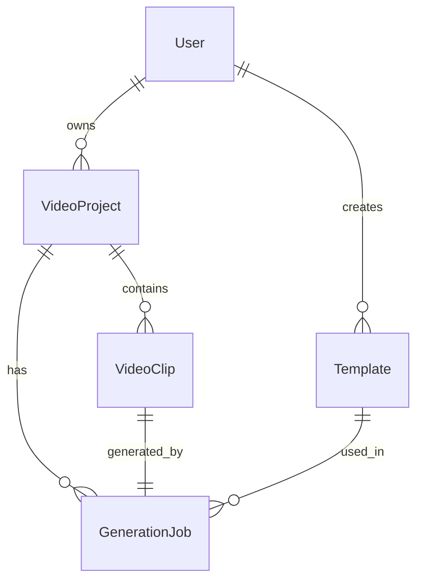

# Data Model: AI Video System

**Feature**: 001-ai-video-html  
**Date**: 2025-11-07  
**Purpose**: Define data entities and relationships for the AI video system

## Core Entities

### User
Represents a user of the AI video system

**Attributes**:
- `id` (UUID, Primary Key): Unique identifier
- `email` (String, Unique): User email address
- `username` (String, Unique): Display username
- `passwordHash` (String): Hashed password
- `createdAt` (DateTime): Account creation timestamp
- `updatedAt` (DateTime): Last update timestamp
- `subscriptionTier` (Enum): FREE, BASIC, PRO, ENTERPRISE
- `storageUsed` (Integer): Bytes of storage used
- `storageLimit` (Integer): Bytes of storage allowed

### VideoProject
Represents a video project created by a user

**Attributes**:
- `id` (UUID, Primary Key): Unique identifier
- `userId` (UUID, Foreign Key): Owner of the project
- `title` (String): Project title
- `description` (Text, Optional): Project description
- `status` (Enum): DRAFT, PROCESSING, COMPLETED, FAILED
- `createdAt` (DateTime): Project creation timestamp
- `updatedAt` (DateTime): Last update timestamp
- `settings` (JSON): Project-specific settings

**Relationships**:
- `User` (Many-to-One): Many projects belong to one user
- `VideoClip` (One-to-Many): One project has many clips
- `GenerationJob` (One-to-Many): One project has many generation jobs

### VideoClip
Represents an individual video clip within a project

**Attributes**:
- `id` (UUID, Primary Key): Unique identifier
- `projectId` (UUID, Foreign Key): Parent project
- `title` (String): Clip title
- `duration` (Float): Duration in seconds
- `fileUrl` (String): S3 URL for the video file
- `thumbnailUrl` (String): URL for thumbnail image
- `fileSize` (Integer): File size in bytes
- `resolution` (String): Video resolution (e.g., "1920x1080")
- `format` (String): Video format (e.g., "mp4", "webm")
- `createdAt` (DateTime): Clip creation timestamp
- `updatedAt` (DateTime): Last update timestamp
- `metadata` (JSON): Additional clip metadata

**Relationships**:
- `VideoProject` (Many-to-One): Many clips belong to one project
- `GenerationJob` (One-to-One): One clip is generated by one job

### GenerationJob
Represents a video generation job

**Attributes**:
- `id` (UUID, Primary Key): Unique identifier
- `projectId` (UUID, Foreign Key): Associated project
- `clipId` (UUID, Foreign Key, Optional): Generated clip
- `jobType` (Enum): GENERATE, EDIT, ENHANCE, TRANSCODE
- `status` (Enum): QUEUED, PROCESSING, COMPLETED, FAILED
- `prompt` (Text): AI generation prompt
- `parameters` (JSON): Generation parameters
- `progress` (Integer): Progress percentage (0-100)
- `errorMessage` (Text, Optional): Error message if failed
- `startedAt` (DateTime, Optional): Job start timestamp
- `completedAt` (DateTime, Optional): Job completion timestamp
- `createdAt` (DateTime): Job creation timestamp

**Relationships**:
- `VideoProject` (Many-to-One): Many jobs belong to one project
- `VideoClip` (One-to-One, Optional): One job generates one clip

### Template
Represents a video template for quick generation

**Attributes**:
- `id` (UUID, Primary Key): Unique identifier
- `name` (String): Template name
- `description` (Text): Template description
- `category` (String): Template category
- `thumbnailUrl` (String): Template thumbnail
- `prompt` (Text): Base generation prompt
- `parameters` (JSON): Default generation parameters
- `isPublic` (Boolean): Whether template is public
- `createdBy` (UUID, Foreign Key, Optional): Creator user ID
- `usageCount` (Integer): Number of times used
- `createdAt` (DateTime): Template creation timestamp
- `updatedAt` (DateTime): Last update timestamp

**Relationships**:
- `User` (Many-to-One, Optional): Many templates created by one user

## Data Relationships

## Data Validation Rules

### User
- Email must be valid format and unique
- Username must be 3-30 characters, alphanumeric + underscores
- Password must be at least 8 characters with mixed case and numbers

### VideoProject
- Title must be 1-100 characters
- Description maximum 1000 characters
- Status must be one of defined enum values

### VideoClip
- Title must be 1-100 characters
- Duration must be positive
- File size must not exceed user's storage limit
- Resolution must match supported formats

### GenerationJob
- Prompt must be 1-2000 characters
- Progress must be 0-100
- Job type and status must be valid enum values

### Template
- Name must be 1-100 characters and unique per user
- Description maximum 1000 characters
- Category must be predefined value

## Storage Considerations

### File Storage
- Video files stored in AWS S3 with lifecycle policies
- Thumbnails stored separately for faster access
- Automatic cleanup of failed generation artifacts

### Database Storage
- User metadata in PostgreSQL
- Large text fields (prompts, descriptions) use TEXT type
- JSON fields for flexible parameter storage
- Indexes on foreign keys and frequently queried fields

## Security Considerations

### Access Control
- Users can only access their own projects and clips
- Public templates accessible to all users
- Private templates only accessible to creator

### Data Privacy
- User data encrypted at rest
- API keys and sensitive data never exposed to client
- Audit logging for all data access

## Performance Considerations

### Indexing Strategy
- Primary keys on all tables
- Foreign key indexes for relationship queries
- Composite indexes on frequently queried field combinations

### Caching Strategy
- Template data cached for quick access
- User session data cached for authentication
- Video metadata cached to reduce database queries

## Scaling Considerations

### Horizontal Scaling
- Database read replicas for query performance
- File storage partitioned by user/project
- Job queue processing distributed across workers

### Vertical Scaling
- Connection pooling for database access
- Optimized queries for large datasets
- Efficient pagination for video lists