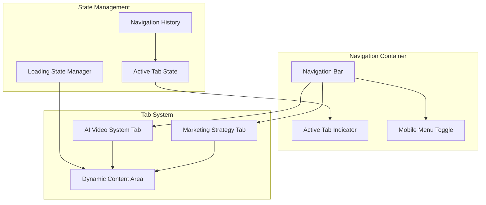

# Tab-Based Integration Approach: Unified Marketing Operations & AI Video System

## Executive Summary

This document outlines a comprehensive integration approach for creating a unified HTML-only interface that seamlessly combines the marketing operations flow with the AI video system. The solution uses a tab-based navigation system that preserves the existing marketing operations visual design while incorporating the AI video system as an additional tab, all within a single HTML file with dynamic component loading.

## 1. Tab-Based Navigation System Design

### 1.1 Navigation Architecture

The tab-based navigation system serves as the primary interface for switching between marketing strategy and AI video system components.



### 1.2 Tab Component Implementation

```javascript
class TabNavigationSystem {
    constructor(container, stateManager) {
        this.container = container;
        this.stateManager = stateManager;
        this.tabs = [
            {
                id: 'marketing',
                name: 'Marketing Strategy',
                icon: 'strategy',
                primary: true,
                component: 'MarketingFlowComponent'
            },
            {
                id: 'ai-video',
                name: 'AI Video System',
                icon: 'video',
                primary: false,
                component: 'AIVideoSystemComponent'
            }
        ];
        this.activeTab = 'marketing';
        this.loadingStates = new Map();
        this.componentCache = new Map();
    }
    
    render() {
        const navigationHTML = `
            <nav class="unified-navigation">
                <div class="nav-brand">
                    <i class="material-icons">marketing</i>
                    <span>Marketing Forge</span>
                </div>
                
                <div class="nav-tabs">
                    ${this.tabs.map(tab => this.renderTab(tab)).join('')}
                </div>
                
                <div class="nav-actions">
                    <button class="mobile-menu-toggle" data-action="toggle-mobile-menu">
                        <i class="material-icons">menu</i>
                    </button>
                </div>
                
                <div class="tab-indicator" style="transform: translateX(${this.getIndicatorPosition()}px)"></div>
            </nav>
        `;
        
        this.container.innerHTML = navigationHTML;
        this.attachEventListeners();
        this.updateActiveTab();
    }
    
    renderTab(tab) {
        const isActive = tab.id === this.activeTab;
        return `
            <button 
                class="nav-tab ${isActive ? 'active' : ''} ${tab.primary ? 'primary' : ''}"
                data-tab-id="${tab.id}"
                data-action="switch-tab"
            >
                <i class="material-icons">${this.getTabIcon(tab.icon)}</i>
                <span class="tab-label">${tab.name}</span>
                ${this.loadingStates.has(tab.id) ? '<div class="tab-loading-spinner"></div>' : ''}
            </button>
        `;
    }
    
    async switchTab(tabId) {
        if (tabId === this.activeTab || this.loadingStates.has(tabId)) {
            return;
        }
        
        // Set loading state
        this.setTabLoading(tabId, true);
        
        try {
            // Hide current tab content
            await this.hideCurrentTab();
            
            // Load and show new tab content
            await this.showTab(tabId);
            
            // Update active state
            this.activeTab = tabId;
            this.stateManager.setState({ currentTab: tabId });
            
            // Update UI
            this.updateActiveTab();
            this.animateTabTransition(tabId);
            
        } catch (error) {
            console.error(`Failed to switch to tab ${tabId}:`, error);
            this.showTabError(tabId, error);
        } finally {
            this.setTabLoading(tabId, false);
        }
    }
    
    async showTab(tabId) {
        const tab = this.tabs.find(t => t.id === tabId);
        if (!tab) throw new Error(`Tab ${tabId} not found`);
        
        const contentContainer = document.getElementById('main-content');
        
        // Check if component is cached
        if (this.componentCache.has(tabId)) {
            const component = this.componentCache.get(tabId);
            component.show();
            return;
        }
        
        // Load component dynamically
        const component = await this.loadComponent(tab.component, contentContainer);
        this.componentCache.set(tabId, component);
        component.show();
    }
    
    async hideCurrentTab() {
        if (this.activeTab && this.componentCache.has(this.activeTab)) {
            const component = this.componentCache.get(this.activeTab);
            component.hide();
        }
    }
    
    animateTabTransition(tabId) {
        const indicator = this.container.querySelector('.tab-indicator');
        const targetPosition = this.getIndicatorPosition(tabId);
        
        indicator.style.transform = `translateX(${targetPosition}px)`;
        indicator.style.width = `${this.getTabWidth(tabId)}px`;
    }
    
    getIndicatorPosition(tabId = this.activeTab) {
        const tabElement = this.container.querySelector(`[data-tab-id="${tabId}"]`);
        if (!tabElement) return 0;
        
        const navRect = this.container.querySelector('.nav-tabs').getBoundingClientRect();
        const tabRect = tabElement.getBoundingClientRect();
        
        return tabRect.left - navRect.left;
    }
    
    getTabWidth(tabId = this.activeTab) {
        const tabElement = this.container.querySelector(`[data-tab-id="${tabId}"]`);
        return tabElement ? tabElement.offsetWidth : 0;
    }
    
    setTabLoading(tabId, isLoading) {
        if (isLoading) {
            this.loadingStates.set(tabId, true);
        } else {
            this.loadingStates.delete(tabId);
        }
        this.render();
    }
    
    showTabError(tabId, error) {
        const contentContainer = document.getElementById('main-content');
        contentContainer.innerHTML = `
            <div class="tab-error">
                <i class="material-icons">error</i>
                <h3>Failed to load ${this.getTabName(tabId)}</h3>
                <p>${error.message}</p>
                <button data-action="retry-tab" data-tab-id="${tabId}">Retry</button>
            </div>
        `;
    }
    
    getTabName(tabId) {
        const tab = this.tabs.find(t => t.id === tabId);
        return tab ? tab.name : tabId;
    }
    
    getTabIcon(iconName) {
        const iconMap = {
            'strategy': 'campaign',
            'video': 'movie',
            'analytics': 'analytics',
            'settings': 'settings'
        };
        return iconMap[iconName] || iconName;
    }
}
```

### 1.3 Navigation CSS Styles

```css
/* Unified Navigation System */
.unified-navigation {
    position: fixed;
    top: 0;
    left: 0;
    right: 0;
    height: 60px;
    background: linear-gradient(135deg, #1a73e8 0%, #4285f4 100%);
    display: flex;
    align-items: center;
    justify-content: space-between;
    padding: 0 20px;
    z-index: 1000;
    box-shadow: 0 2px 10px rgba(0, 0, 0, 0.1);
}

.nav-brand {
    display: flex;
    align-items: center;
    color: white;
    font-weight: bold;
    font-size: 18px;
    gap: 10px;
}

.nav-tabs {
    display: flex;
    align-items: center;
    gap: 5px;
    position: relative;
    flex: 1;
    justify-content: center;
}

.nav-tab {
    display: flex;
    align-items: center;
    gap: 8px;
    padding: 10px 20px;
    border: none;
    background: transparent;
    color: rgba(255, 255, 255, 0.7);
    border-radius: 25px;
    cursor: pointer;
    transition: all 0.3s ease;
    font-weight: 500;
    position: relative;
    overflow: hidden;
}

.nav-tab:hover {
    background: rgba(255, 255, 255, 0.1);
    color: white;
}

.nav-tab.active {
    background: rgba(255, 255, 255, 0.2);
    color: white;
    font-weight: 600;
}

.nav-tab.primary {
    background: rgba(255, 255, 255, 0.15);
    border: 1px solid rgba(255, 255, 255, 0.3);
}

.nav-tab.primary.active {
    background: rgba(255, 255, 255, 0.25);
    border-color: rgba(255, 255, 255, 0.5);
}

.tab-indicator {
    position: absolute;
    bottom: 0;
    height: 3px;
    background: white;
    border-radius: 3px 3px 0 0;
    transition: all 0.3s cubic-bezier(0.4, 0, 0.2, 1);
}

.tab-loading-spinner {
    width: 16px;
    height: 16px;
    border: 2px solid rgba(255, 255, 255, 0.3);
    border-top: 2px solid white;
    border-radius: 50%;
    animation: spin 1s linear infinite;
    margin-left: 8px;
}

.nav-actions {
    display: flex;
    align-items: center;
    gap: 10px;
}

.mobile-menu-toggle {
    display: none;
    background: transparent;
    border: none;
    color: white;
    cursor: pointer;
    padding: 8px;
    border-radius: 50%;
}

.mobile-menu-toggle:hover {
    background: rgba(255, 255, 255, 0.1);
}

/* Mobile Responsive */
@media (max-width: 768px) {
    .unified-navigation {
        padding: 0 15px;
    }
    
    .nav-brand span {
        display: none;
    }
    
    .nav-tabs {
        position: fixed;
        top: 60px;
        left: 0;
        right: 0;
        background: #1a73e8;
        flex-direction: column;
        padding: 20px;
        gap: 10px;
        transform: translateY(-100%);
        transition: transform 0.3s ease;
        z-index: 999;
    }
    
    .nav-tabs.open {
        transform: translateY(0);
    }
    
    .nav-tab {
        width: 100%;
        justify-content: center;
        padding: 15px;
        border-radius: 10px;
    }
    
    .mobile-menu-toggle {
        display: block;
    }
    
    .tab-indicator {
        display: none;
    }
}

/* Tab Content Container */
.main-content {
    margin-top: 60px;
    min-height: calc(100vh - 60px);
    position: relative;
    overflow: hidden;
}

.tab-content {
    position: absolute;
    top: 0;
    left: 0;
    right: 0;
    bottom: 0;
    opacity: 0;
    transform: translateX(100%);
    transition: all 0.3s ease;
    overflow-y: auto;
}

.tab-content.active {
    opacity: 1;
    transform: translateX(0);
}

.tab-error {
    display: flex;
    flex-direction: column;
    align-items: center;
    justify-content: center;
    height: 100%;
    padding: 40px;
    text-align: center;
    color: #5f6368;
}

.tab-error .material-icons {
    font-size: 48px;
    color: #ea4335;
    margin-bottom: 20px;
}

.tab-error h3 {
    color: #202124;
    margin-bottom: 10px;
}

.tab-error button {
    margin-top: 20px;
    padding: 10px 20px;
    background: #1a73e8;
    color: white;
    border: none;
    border-radius: 5px;
    cursor: pointer;
    font-weight: 500;
}

.tab-error button:hover {
    background: #1557b0;
}
```

## 2. Visual Integration Strategy

### 2.1 Design System Preservation

The visual integration strategy preserves the existing marketing operations design while incorporating AI video system UI elements seamlessly.

```css
/* Design System Variables */
:root {
    /* Marketing Operations Colors */
    --primary-blue: #1a73e8;
    --secondary-blue: #4285f4;
    --tertiary-blue: #8ab4f8;
    --light-blue: #e8f0fe;
    --text-primary: #2c3e50;
    --text-secondary: #5f6368;
    --background-light: #f5f7fa;
    --background-white: #ffffff;
    
    /* AI Video System Colors (Integrated) */
    --ai-purple: #9c27b0;
    --ai-pink: #e91e63;
    --gradient-ai: linear-gradient(135deg, var(--ai-purple) 0%, var(--ai-pink) 100%);
    
    /* Shared Design Tokens */
    --border-radius: 8px;
    --border-radius-large: 25px;
    --shadow-light: 0 2px 8px rgba(0, 0, 0, 0.1);
    --shadow-medium: 0 4px 16px rgba(0, 0, 0, 0.15);
    --shadow-heavy: 0 8px 32px rgba(0, 0, 0, 0.2);
    --transition-fast: 0.2s ease;
    --transition-smooth: 0.3s ease;
    --transition-bounce: 0.3s cubic-bezier(0.68, -0.55, 0.265, 1.55);
}

/* Unified Component Base Styles */
.unified-component {
    font-family: 'Source Sans Pro', sans-serif;
    color: var(--text-primary);
    background: var(--background-white);
    border-radius: var(--border-radius);
    box-shadow: var(--shadow-light);
    transition: var(--transition-smooth);
}

.unified-button {
    padding: 10px 20px;
    border: none;
    border-radius: var(--border-radius);
    font-weight: 600;
    cursor: pointer;
    transition: var(--transition-smooth);
    display: inline-flex;
    align-items: center;
    gap: 8px;
}

.unified-button.primary {
    background: var(--primary-blue);
    color: white;
}

.unified-button.primary:hover {
    background: var(--secondary-blue);
    transform: translateY(-2px);
    box-shadow: var(--shadow-medium);
}

.unified-button.secondary {
    background: var(--light-blue);
    color: var(--primary-blue);
}

.unified-button.ai-accent {
    background: var(--gradient-ai);
    color: white;
}

/* Marketing Operations Specific Styles */
.marketing-flow-node {
    background-color: var(--light-blue);
    border: 2px solid var(--primary-blue);
    border-radius: var(--border-radius);
    padding: 16px 24px;
    text-align: center;
    font-weight: 600;
    font-size: 18px;
    color: var(--primary-blue);
    position: relative;
    z-index: 2;
    transition: var(--transition-smooth);
    display: flex;
    flex-direction: column;
    align-items: center;
    justify-content: center;
    min-width: 180px;
}

.marketing-flow-node:hover {
    transform: translateY(-3px);
    box-shadow: 0 6px 12px rgba(26, 115, 232, 0.15);
}

/* AI Video System Integrated Styles */
.ai-video-component {
    background: var(--background-white);
    border-radius: var(--border-radius);
    padding: 20px;
    box-shadow: var(--shadow-light);
}

.ai-video-header {
    display: flex;
    align-items: center;
    justify-content: space-between;
    margin-bottom: 20px;
    padding-bottom: 15px;
    border-bottom: 2px solid var(--light-blue);
}

.ai-video-title {
    font-size: 24px;
    font-weight: 700;
    color: var(--primary-blue);
    display: flex;
    align-items: center;
    gap: 10px;
}

.ai-video-title .ai-accent {
    background: var(--gradient-ai);
    -webkit-background-clip: text;
    -webkit-text-fill-color: transparent;
    background-clip: text;
}

.ai-video-controls {
    display: flex;
    gap: 10px;
}

/* Unified Card System */
.unified-card {
    background: var(--background-white);
    border-radius: var(--border-radius);
    padding: 20px;
    box-shadow: var(--shadow-light);
    transition: var(--transition-smooth);
    border: 1px solid rgba(26, 115, 232, 0.1);
}

.unified-card:hover {
    transform: translateY(-2px);
    box-shadow: var(--shadow-medium);
}

.unified-card.marketing {
    border-color: var(--primary-blue);
}

.unified-card.ai-video {
    border-color: var(--ai-purple);
    border-left: 4px solid var(--ai-purple);
}

/* Unified Form Elements */
.unified-input {
    width: 100%;
    padding: 12px 16px;
    border: 2px solid var(--light-blue);
    border-radius: var(--border-radius);
    font-size: 16px;
    transition: var(--transition-fast);
    background: var(--background-white);
}

.unified-input:focus {
    outline: none;
    border-color: var(--primary-blue);
    box-shadow: 0 0 0 3px rgba(26, 115, 232, 0.1);
}

.unified-input.ai-focus:focus {
    border-color: var(--ai-purple);
    box-shadow: 0 0 0 3px rgba(156, 39, 176, 0.1);
}
```

### 2.2 Component Visual Integration

```javascript
class VisualIntegrationManager {
    constructor() {
        this.themeManager = new ThemeManager();
        this.componentStyler = new ComponentStyler();
        this.animationController = new AnimationController();
    }
    
    // Apply unified styling to components
    applyUnifiedStyling(component, type) {
        const baseClasses = ['unified-component'];
        const typeClasses = this.getTypeClasses(type);
        const themeClasses = this.themeManager.getThemeClasses();
        
        component.className = [...baseClasses, ...typeClasses, ...themeClasses].join(' ');
        
        // Apply type-specific styling
        this.applyTypeSpecificStyling(component, type);
        
        // Setup animations
        this.animationController.setupComponentAnimations(component, type);
    }
    
    getTypeClasses(type) {
        const classMap = {
            'marketing-node': ['marketing-flow-node'],
            'ai-video-card': ['ai-video-component', 'unified-card'],
            'navigation': ['unified-navigation'],
            'button-primary': ['unified-button', 'primary'],
            'button-secondary': ['unified-button', 'secondary'],
            'button-ai': ['unified-button', 'ai-accent'],
            'input-field': ['unified-input'],
            'input-ai': ['unified-input', 'ai-focus']
        };
        
        return classMap[type] || [];
    }
    
    applyTypeSpecificStyling(component, type) {
        switch (type) {
            case 'marketing-node':
                this.styleMarketingNode(component);
                break;
            case 'ai-video-card':
                this.styleAIVideoCard(component);
                break;
            case 'navigation':
                this.styleNavigation(component);
                break;
        }
    }
    
    styleMarketingNode(node) {
        // Preserve existing marketing node styling
        node.style.backgroundColor = 'var(--light-blue)';
        node.style.border = '2px solid var(--primary-blue)';
        node.style.color = 'var(--primary-blue)';
        
        // Add hover effects
        node.addEventListener('mouseenter', () => {
            node.style.transform = 'translateY(-3px)';
            node.style.boxShadow = '0 6px 12px rgba(26, 115, 232, 0.15)';
        });
        
        node.addEventListener('mouseleave', () => {
            node.style.transform = 'translateY(0)';
            node.style.boxShadow = 'var(--shadow-light)';
        });
    }
    
    styleAIVideoCard(card) {
        // Apply AI video system styling with marketing integration
        card.style.borderLeft = '4px solid var(--ai-purple)';
        card.style.position = 'relative';
        
        // Add AI accent indicator
        const accentIndicator = document.createElement('div');
        accentIndicator.className = 'ai-accent-indicator';
        accentIndicator.style.cssText = `
            position: absolute;
            top: 10px;
            right: 10px;
            width: 8px;
            height: 8px;
            background: var(--gradient-ai);
            border-radius: 50%;
        `;
        card.appendChild(accentIndicator);
    }
    
    styleNavigation(nav) {
        // Apply unified navigation styling
        nav.style.background = 'linear-gradient(135deg, #1a73e8 0%, #4285f4 100%)';
        nav.style.boxShadow = '0 2px 10px rgba(0, 0, 0, 0.1)';
    }
}
```

## 3. Component Loading and Unloading Patterns

### 3.1 Dynamic Component Loader

```javascript
class ComponentLoader {
    constructor(stateManager, eventBus) {
        this.stateManager = stateManager;
        this.eventBus = eventBus;
        this.loadedComponents = new Map();
        this.loadingPromises = new Map();
        this.componentRegistry = new Map();
        this.performanceMonitor = new PerformanceMonitor();
        
        this.registerComponents();
    }
    
    registerComponents() {
        // Register marketing flow component
        this.componentRegistry.set('marketing-flow', {
            class: MarketingFlowComponent,
            dependencies: [],
            preload: true,
            lazy: false
        });
        
        // Register AI video system components
        this.componentRegistry.set('ai-video-system', {
            class: AIVideoSystemComponent,
            dependencies: ['video-editor', 'asset-library'],
            preload: false,
            lazy: true
        });
        
        this.componentRegistry.set('video-editor', {
            class: VideoEditorComponent,
            dependencies: ['timeline', 'canvas', 'controls'],
            preload: false,
            lazy: true
        });
        
        this.componentRegistry.set('asset-library', {
            class: AssetLibraryComponent,
            dependencies: [],
            preload: false,
            lazy: true
        });
    }
    
    async loadComponent(componentId, container) {
        // Check if component is already loaded
        if (this.loadedComponents.has(componentId)) {
            return this.loadedComponents.get(componentId);
        }
        
        // Check if component is currently loading
        if (this.loadingPromises.has(componentId)) {
            return this.loadingPromises.get(componentId);
        }
        
        // Start loading process
        const loadingPromise = this.loadComponentInternal(componentId, container);
        this.loadingPromises.set(componentId, loadingPromise);
        
        try {
            const component = await loadingPromise;
            this.loadedComponents.set(componentId, component);
            return component;
        } finally {
            this.loadingPromises.delete(componentId);
        }
    }
    
    async loadComponentInternal(componentId, container) {
        const config = this.componentRegistry.get(componentId);
        if (!config) {
            throw new Error(`Component ${componentId} not registered`);
        }
        
        // Show loading indicator
        this.showLoadingIndicator(container, componentId);
        
        try {
            // Load dependencies first
            await this.loadDependencies(config.dependencies);
            
            // Load component CSS if needed
            await this.loadComponentStyles(componentId);
            
            // Create component instance
            const ComponentClass = config.class;
            const component = new ComponentClass(container, this.stateManager, this.eventBus);
            
            // Initialize component
            await component.initialize();
            
            // Render component
            component.render();
            
            // Track performance
            this.performanceMonitor.recordComponentLoad(componentId, performance.now());
            
            return component;
        } finally {
            this.hideLoadingIndicator(container);
        }
    }
    
    async loadDependencies(dependencies) {
        const loadPromises = dependencies.map(dep => this.loadComponent(dep));
        await Promise.all(loadPromises);
    }
    
    async loadComponentStyles(componentId) {
        const styleMap = {
            'marketing-flow': 'marketing-flow-styles',
            'ai-video-system': 'ai-video-styles',
            'video-editor': 'video-editor-styles',
            'asset-library': 'asset-library-styles'
        };
        
        const styleId = styleMap[componentId];
        if (!styleId || document.getElementById(styleId)) {
            return;
        }
        
        // Create and append style element
        const styleElement = document.createElement('style');
        styleElement.id = styleId;
        styleElement.textContent = this.getComponentStyles(componentId);
        document.head.appendChild(styleElement);
    }
    
    getComponentStyles(componentId) {
        // Return component-specific CSS
        const styles = {
            'marketing-flow': this.getMarketingFlowStyles(),
            'ai-video-system': this.getAIVideoSystemStyles(),
            'video-editor': this.getVideoEditorStyles(),
            'asset-library': this.getAssetLibraryStyles()
        };
        
        return styles[componentId] || '';
    }
    
    unloadComponent(componentId) {
        if (!this.loadedComponents.has(componentId)) {
            return;
        }
        
        const component = this.loadedComponents.get(componentId);
        
        // Cleanup component
        if (component.destroy) {
            component.destroy();
        }
        
        // Remove from DOM
        if (component.container) {
            component.container.innerHTML = '';
        }
        
        // Remove from cache
        this.loadedComponents.delete(componentId);
        
        // Track performance
        this.performanceMonitor.recordComponentUnload(componentId, performance.now());
    }
    
    showLoadingIndicator(container, componentId) {
        const indicator = document.createElement('div');
        indicator.className = 'component-loading-indicator';
        indicator.innerHTML = `
            <div class="loading-spinner"></div>
            <div class="loading-text">Loading ${this.getComponentName(componentId)}...</div>
        `;
        container.appendChild(indicator);
    }
    
    hideLoadingIndicator(container) {
        const indicator = container.querySelector('.component-loading-indicator');
        if (indicator) {
            indicator.remove();
        }
    }
    
    getComponentName(componentId) {
        const nameMap = {
            'marketing-flow': 'Marketing Strategy',
            'ai-video-system': 'AI Video System',
            'video-editor': 'Video Editor',
            'asset-library': 'Asset Library'
        };
        
        return nameMap[componentId] || componentId;
    }
}
```

### 3.2 Component Lifecycle Management

```javascript
class ComponentLifecycleManager {
    constructor(stateManager, eventBus) {
        this.stateManager = stateManager;
        this.eventBus = eventBus;
        this.activeComponents = new Map();
        this.componentStates = new Map();
        this.transitionController = new TransitionController();
    }
    
    async activateComponent(componentId, container) {
        // Deactivate current component if exists
        if (this.activeComponents.size > 0) {
            await this.deactivateCurrentComponent();
        }
        
        // Load and activate new component
        const component = await this.loadComponent(componentId, container);
        
        // Setup component state
        this.setupComponentState(componentId, component);
        
        // Start transition
        await this.transitionController.transitionIn(component);
        
        // Mark as active
        this.activeComponents.set(componentId, component);
        
        // Emit activation event
        this.eventBus.emit('component-activated', { componentId, component });
    }
    
    async deactivateCurrentComponent() {
        const [currentComponentId, currentComponent] = this.activeComponents.entries().next().value;
        
        if (!currentComponent) {
            return;
        }
        
        // Save component state
        this.saveComponentState(currentComponentId, currentComponent);
        
        // Start transition out
        await this.transitionController.transitionOut(currentComponent);
        
        // Hide component
        currentComponent.hide();
        
        // Remove from active
        this.activeComponents.delete(currentComponentId);
        
        // Emit deactivation event
        this.eventBus.emit('component-deactivated', { componentId: currentComponentId, component: currentComponent });
    }
    
    setupComponentState(componentId, component) {
        // Restore previous state if exists
        const previousState = this.componentStates.get(componentId);
        if (previousState) {
            component.setState(previousState);
        }
        
        // Setup state change listener
        component.onStateChange((newState) => {
            this.componentStates.set(componentId, newState);
        });
    }
    
    saveComponentState(componentId, component) {
        const state = component.getState();
        this.componentStates.set(componentId, state);
    }
    
    async preloadComponent(componentId) {
        const config = this.componentRegistry.get(componentId);
        if (!config || !config.preload) {
            return;
        }
        
        // Create hidden container for preloading
        const preloadContainer = document.createElement('div');
        preloadContainer.style.display = 'none';
        document.body.appendChild(preloadContainer);
        
        try {
            await this.loadComponent(componentId, preloadContainer);
        } finally {
            document.body.removeChild(preloadContainer);
        }
    }
    
    cleanup() {
        // Deactivate all active components
        for (const [componentId, component] of this.activeComponents) {
            this.saveComponentState(componentId, component);
            if (component.destroy) {
                component.destroy();
            }
        }
        
        this.activeComponents.clear();
        this.componentStates.clear();
    }
}
```

## 4. State Management Across Tab Switches

### 4.1 Unified State Manager

```javascript
class UnifiedStateManager {
    constructor() {
        this.state = {
            // Navigation state
            currentTab: 'marketing',
            tabHistory: [],
            
            // Marketing flow state
            marketing: {
                flowchartData: null,
                interactiveElements: [],
                selectedNodes: [],
                zoomLevel: 1,
                scrollPosition: { x: 0, y: 0 }
            },
            
            // AI video system state
            aiVideo: {
                currentView: 'dashboard',
                currentProject: null,
                projects: [],
                assets: [],
                templates: [],
                processingJobs: [],
                editorState: {
                    timeline: null,
                    selectedAssets: [],
                    playbackTime: 0,
                    isPlaying: false
                }
            },
            
            // Shared UI state
            ui: {
                loading: false,
                notifications: [],
                sidebarOpen: false,
                theme: 'light',
                modals: [],
                breadcrumbs: []
            },
            
            // User session state
            user: {
                isAuthenticated: false,
                profile: null,
                preferences: {},
                sessionToken: null
            }
        };
        
        this.subscribers = new Map();
        this.persistenceKeys = [
            'currentTab', 'marketing', 'aiVideo', 'ui.theme', 'user.preferences'
        ];
        this.stateVersion = 0;
        
        this.loadFromStorage();
        this.setupAutoSave();
    }
    
    // Subscribe to state changes
    subscribe(key, callback) {
        if (!this.subscribers.has(key)) {
            this.subscribers.set(key, new Set());
        }
        this.subscribers.get(key).add(callback);
        
        // Return unsubscribe function
        return () => {
            this.subscribers.get(key).delete(callback);
        };
    }
    
    // Update state
    setState(updates, notify = true) {
        const prevState = { ...this.state };
        const prevVersion = this.stateVersion;
        
        // Deep merge updates
        this.state = this.deepMerge(this.state, updates);
        this.stateVersion++;
        
        // Save to localStorage if needed
        this.saveToStorage(updates);
        
        // Notify subscribers
        if (notify) {
            this.notifySubscribers(updates, prevState, prevVersion);
        }
        
        // Emit state change event
        this.emitStateChange(updates, prevState);
    }
    
    // Get state or specific path
    getState(path = null) {
        if (!path) return this.state;
        
        return path.split('.').reduce((obj, key) => obj?.[key], this.state);
    }
    
    // Get state version
    getStateVersion() {
        return this.stateVersion;
    }
    
    // Notify subscribers of state changes
    notifySubscribers(updates, prevState, prevVersion) {
        Object.keys(updates).forEach(key => {
            if (this.subscribers.has(key)) {
                const newValue = this.getState(key);
                const prevValue = path.split('.').reduce((obj, k) => obj?.[k], prevState);
                
                this.subscribers.get(key).forEach(callback => {
                    try {
                        callback(newValue, prevValue, this.stateVersion, prevVersion);
                    } catch (error) {
                        console.error(`Error in state subscriber for ${key}:`, error);
                    }
                });
            }
        });
    }
    
    // Emit state change event
    emitStateChange(updates, prevState) {
        const event = new CustomEvent('stateChange', {
            detail: {
                updates,
                prevState,
                currentState: this.state,
                version: this.stateVersion
            }
        });
        document.dispatchEvent(event);
    }
    
    // Deep merge objects
    deepMerge(target, source) {
        const result = { ...target };
        
        Object.keys(source).forEach(key => {
            if (source[key] && typeof source[key] === 'object' && !Array.isArray(source[key])) {
                result[key] = this.deepMerge(result[key] || {}, source[key]);
            } else {
                result[key] = source[key];
            }
        });
        
        return result;
    }
    
    // Save state to localStorage
    saveToStorage(updates) {
        this.persistenceKeys.forEach(key => {
            if (this.hasNestedKey(updates, key)) {
                const value = this.getState(key);
                try {
                    localStorage.setItem(`marketing_forge_${key}`, JSON.stringify(value));
                } catch (error) {
                    console.warn(`Failed to save ${key} to storage:`, error);
                }
            }
        });
    }
    
    // Load state from localStorage
    loadFromStorage() {
        this.persistenceKeys.forEach(key => {
            const stored = localStorage.getItem(`marketing_forge_${key}`);
            if (stored) {
                try {
                    const value = JSON.parse(stored);
                    this.state = this.deepMerge(this.state, { [key]: value });
                } catch (error) {
                    console.warn(`Failed to load ${key} from storage:`, error);
                }
            }
        });
    }
    
    // Setup auto-save
    setupAutoSave() {
        // Auto-save every 30 seconds
        setInterval(() => {
            this.saveToStorage(this.state);
        }, 30000);
        
        // Save on page unload
        window.addEventListener('beforeunload', () => {
            this.saveToStorage(this.state);
        });
    }
    
    // Check if object has nested key
    hasNestedKey(obj, keyPath) {
        return keyPath.split('.').some(key => key in obj);
    }
    
    // Reset state
    reset(keys = null) {
        if (keys) {
            // Reset specific keys
            const updates = {};
            keys.forEach(key => {
                updates[key] = this.getDefaultState(key);
            });
            this.setState(updates);
        } else {
            // Reset all state
            this.state = this.getDefaultState();
            this.setState(this.state);
        }
    }
    
    // Get default state for key
    getDefaultState(key = null) {
        const defaultState = {
            currentTab: 'marketing',
            tabHistory: [],
            marketing: {
                flowchartData: null,
                interactiveElements: [],
                selectedNodes: [],
                zoomLevel: 1,
                scrollPosition: { x: 0, y: 0 }
            },
            aiVideo: {
                currentView: 'dashboard',
                currentProject: null,
                projects: [],
                assets: [],
                templates: [],
                processingJobs: [],
                editorState: {
                    timeline: null,
                    selectedAssets: [],
                    playbackTime: 0,
                    isPlaying: false
                }
            },
            ui: {
                loading: false,
                notifications: [],
                sidebarOpen: false,
                theme: 'light',
                modals: [],
                breadcrumbs: []
            },
            user: {
                isAuthenticated: false,
                profile: null,
                preferences: {},
                sessionToken: null
            }
        };
        
        return key ? defaultState[key] : defaultState;
    }
}
```

### 4.2 Tab State Persistence

```javascript
class TabStatePersistence {
    constructor(stateManager) {
        this.stateManager = stateManager;
        this.setupTabStateListeners();
    }
    
    setupTabStateListeners() {
        // Listen for tab switches
        this.stateManager.subscribe('currentTab', (newTab, prevTab) => {
            this.saveTabState(prevTab);
            this.restoreTabState(newTab);
        });
        
        // Listen for marketing state changes
        this.stateManager.subscribe('marketing', (newState) => {
            if (this.stateManager.getState('currentTab') === 'marketing') {
                this.saveTabState('marketing');
            }
        });
        
        // Listen for AI video state changes
        this.stateManager.subscribe('aiVideo', (newState) => {
            if (this.stateManager.getState('currentTab') === 'ai-video') {
                this.saveTabState('ai-video');
            }
        });
    }
    
    saveTabState(tabId) {
        const stateKey = `tabState_${tabId}`;
        let stateToSave;
        
        switch (tabId) {
            case 'marketing':
                stateToSave = this.stateManager.getState('marketing');
                break;
            case 'ai-video':
                stateToSave = this.stateManager.getState('aiVideo');
                break;
            default:
                return;
        }
        
        try {
            localStorage.setItem(stateKey, JSON.stringify(stateToSave));
        } catch (error) {
            console.warn(`Failed to save tab state for ${tabId}:`, error);
        }
    }
    
    restoreTabState(tabId) {
        const stateKey = `tabState_${tabId}`;
        const storedState = localStorage.getItem(stateKey);
        
        if (!storedState) {
            return;
        }
        
        try {
            const parsedState = JSON.parse(storedState);
            
            switch (tabId) {
                case 'marketing':
                    this.stateManager.setState({ marketing: parsedState });
                    break;
                case 'ai-video':
                    this.stateManager.setState({ aiVideo: parsedState });
                    break;
            }
        } catch (error) {
            console.warn(`Failed to restore tab state for ${tabId}:`, error);
        }
    }
    
    clearTabState(tabId) {
        const stateKey = `tabState_${tabId}`;
        localStorage.removeItem(stateKey);
    }
    
    getAllTabStates() {
        const tabs = ['marketing', 'ai-video'];
        const states = {};
        
        tabs.forEach(tabId => {
            const stateKey = `tabState_${tabId}`;
            const storedState = localStorage.getItem(stateKey);
            
            if (storedState) {
                try {
                    states[tabId] = JSON.parse(storedState);
                } catch (error) {
                    console.warn(`Failed to parse tab state for ${tabId}:`, error);
                }
            }
        });
        
        return states;
    }
}
```

## 5. Responsive Design Considerations

### 5.1 Mobile-First Responsive Framework

```css
/* Responsive Design System */
.responsive-container {
    width: 100%;
    max-width: 1200px;
    margin: 0 auto;
    padding: 0 20px;
}

/* Grid System */
.responsive-grid {
    display: grid;
    gap: 20px;
    grid-template-columns: 1fr;
}

@media (min-width: 768px) {
    .responsive-grid {
        grid-template-columns: repeat(2, 1fr);
    }
}

@media (min-width: 1024px) {
    .responsive-grid {
        grid-template-columns: repeat(3, 1fr);
    }
}

@media (min-width: 1440px) {
    .responsive-grid {
        grid-template-columns: repeat(4, 1fr);
    }
}

/* Flexbox System */
.responsive-flex {
    display: flex;
    flex-direction: column;
    gap: 20px;
}

@media (min-width: 768px) {
    .responsive-flex {
        flex-direction: row;
        flex-wrap: wrap;
    }
    
    .responsive-flex > * {
        flex: 1;
        min-width: 300px;
    }
}

/* Marketing Flow Responsive */
.marketing-flow-container {
    overflow-x: auto;
    overflow-y: auto;
    padding: 20px;
}

@media (max-width: 768px) {
    .marketing-flow-container {
        padding: 10px;
    }
    
    .flowchart-node {
        min-width: 140px;
        font-size: 14px;
        padding: 12px 16px;
    }
    
    .flowchart-node.main {
        min-width: 180px;
        font-size: 16px;
        padding: 14px 24px;
    }
    
    .node-group {
        gap: 10px;
    }
    
    .platform-container {
        flex-direction: column;
        align-items: center;
    }
    
    .platform-node {
        width: 100%;
        max-width: 300px;
    }
}

/* AI Video System Responsive */
.ai-video-dashboard {
    display: grid;
    grid-template-columns: 1fr;
    gap: 20px;
}

@media (min-width: 768px) {
    .ai-video-dashboard {
        grid-template-columns: 2fr 1fr;
    }
}

@media (min-width: 1024px) {
    .ai-video-dashboard {
        grid-template-columns: 3fr 1fr 1fr;
    }
}

.video-editor-container {
    display: flex;
    flex-direction: column;
    height: 100vh;
}

@media (min-width: 768px) {
    .video-editor-container {
        flex-direction: row;
    }
}

.video-timeline {
    height: 200px;
    order: 2;
}

@media (min-width: 768px) {
    .video-timeline {
        height: 100%;
        width: 300px;
        order: 1;
    }
}

.video-canvas {
    flex: 1;
    order: 1;
    min-height: 300px;
}

@media (min-width: 768px) {
    .video-canvas {
        order: 2;
    }
}

/* Navigation Responsive */
.unified-navigation {
    padding: 0 20px;
}

@media (max-width: 768px) {
    .unified-navigation {
        padding: 0 15px;
    }
    
    .nav-brand span {
        display: none;
    }
    
    .nav-tabs {
        position: fixed;
        top: 60px;
        left: 0;
        right: 0;
        background: #1a73e8;
        flex-direction: column;
        padding: 20px;
        gap: 10px;
        transform: translateY(-100%);
        transition: transform 0.3s ease;
        z-index: 999;
    }
    
    .nav-tabs.open {
        transform: translateY(0);
    }
    
    .nav-tab {
        width: 100%;
        justify-content: center;
        padding: 15px;
        border-radius: 10px;
    }
    
    .mobile-menu-toggle {
        display: block;
    }
}

/* Touch-Friendly Interactions */
@media (hover: none) and (pointer: coarse) {
    .flowchart-node:hover {
        transform: none;
        box-shadow: var(--shadow-light);
    }
    
    .flowchart-node:active {
        transform: scale(0.95);
    }
    
    .unified-button {
        min-height: 44px;
        min-width: 44px;
    }
    
    .nav-tab {
        min-height: 48px;
    }
}

/* High DPI Displays */
@media (-webkit-min-device-pixel-ratio: 2), (min-resolution: 192dpi) {
    .material-icons {
        font-size: 24px;
    }
    
    .loading-spinner {
        border-width: 3px;
    }
}

/* Reduced Motion */
@media (prefers-reduced-motion: reduce) {
    * {
        animation-duration: 0.01ms !important;
        animation-iteration-count: 1 !important;
        transition-duration: 0.01ms !important;
    }
    
    .flowchart-node:hover {
        transform: none;
    }
    
    .tab-indicator {
        transition: none;
    }
}

/* Dark Mode Support */
@media (prefers-color-scheme: dark) {
    :root {
        --background-light: #1a1a1a;
        --background-white: #2d2d2d;
        --text-primary: #ffffff;
        --text-secondary: #b0b0b0;
        --light-blue: #1e3a5f;
    }
    
    .unified-navigation {
        background: linear-gradient(135deg, #0d47a1 0%, #1565c0 100%);
    }
}
```

### 5.2 Responsive Component Manager

```javascript
class ResponsiveManager {
    constructor() {
        this.breakpoints = {
            mobile: 480,
            tablet: 768,
            desktop: 1024,
            wide: 1440
        };
        
        this.currentBreakpoint = this.getCurrentBreakpoint();
        this.orientation = this.getOrientation();
        this.listeners = new Set();
        
        this.setupEventListeners();
    }
    
    setupEventListeners() {
        // Listen for window resize
        window.addEventListener('resize', this.debounce(() => {
            this.handleResize();
        }, 250));
        
        // Listen for orientation change
        window.addEventListener('orientationchange', () => {
            this.handleOrientationChange();
        });
    }
    
    handleResize() {
        const newBreakpoint = this.getCurrentBreakpoint();
        const newOrientation = this.getOrientation();
        
        if (newBreakpoint !== this.currentBreakpoint) {
            this.handleBreakpointChange(this.currentBreakpoint, newBreakpoint);
            this.currentBreakpoint = newBreakpoint;
        }
        
        if (newOrientation !== this.orientation) {
            this.handleOrientationChange(this.orientation, newOrientation);
            this.orientation = newOrientation;
        }
    }
    
    handleBreakpointChange(oldBreakpoint, newBreakpoint) {
        // Notify listeners
        this.listeners.forEach(listener => {
            if (listener.onBreakpointChange) {
                listener.onBreakpointChange(oldBreakpoint, newBreakpoint);
            }
        });
        
        // Emit custom event
        const event = new CustomEvent('breakpointChange', {
            detail: { oldBreakpoint, newBreakpoint }
        });
        document.dispatchEvent(event);
        
        // Update body class
        document.body.classList.remove(`breakpoint-${oldBreakpoint}`);
        document.body.classList.add(`breakpoint-${newBreakpoint}`);
    }
    
    handleOrientationChange(oldOrientation, newOrientation) {
        // Notify listeners
        this.listeners.forEach(listener => {
            if (listener.onOrientationChange) {
                listener.onOrientationChange(oldOrientation, newOrientation);
            }
        });
        
        // Emit custom event
        const event = new CustomEvent('orientationChange', {
            detail: { oldOrientation, newOrientation }
        });
        document.dispatchEvent(event);
        
        // Update body class
        document.body.classList.remove(`orientation-${oldOrientation}`);
        document.body.classList.add(`orientation-${newOrientation}`);
    }
    
    getCurrentBreakpoint() {
        const width = window.innerWidth;
        
        if (width < this.breakpoints.mobile) {
            return 'mobile';
        } else if (width < this.breakpoints.tablet) {
            return 'mobile-large';
        } else if (width < this.breakpoints.desktop) {
            return 'tablet';
        } else if (width < this.breakpoints.wide) {
            return 'desktop';
        } else {
            return 'wide';
        }
    }
    
    getOrientation() {
        return window.innerHeight > window.innerWidth ? 'portrait' : 'landscape';
    }
    
    isMobile() {
        return ['mobile', 'mobile-large'].includes(this.currentBreakpoint);
    }
    
    isTablet() {
        return this.currentBreakpoint === 'tablet';
    }
    
    isDesktop() {
        return ['desktop', 'wide'].includes(this.currentBreakpoint);
    }
    
    addListener(listener) {
        this.listeners.add(listener);
    }
    
    removeListener(listener) {
        this.listeners.delete(listener);
    }
    
    debounce(func, wait) {
        let timeout;
        return function executedFunction(...args) {
            const later = () => {
                clearTimeout(timeout);
                func(...args);
            };
            clearTimeout(timeout);
            timeout = setTimeout(later, wait);
        };
    }
}
```

## 6. Performance Optimization

### 6.1 Tab Switching Performance

```javascript
class TabPerformanceOptimizer {
    constructor() {
        this.performanceMetrics = new Map();
        this.optimizationStrategies = new Map();
        this.setupOptimizations();
    }
    
    setupOptimizations() {
        // Preload critical components
        this.optimizationStrategies.set('preload', {
            execute: this.preloadCriticalComponents.bind(this)
        });
        
        // Lazy load non-critical components
        this.optimizationStrategies.set('lazyLoad', {
            execute: this.lazyLoadComponents.bind(this)
        });
        
        // Cache rendered components
        this.optimizationStrategies.set('cache', {
            execute: this.cacheComponents.bind(this)
        });
        
        // Optimize DOM operations
        this.optimizationStrategies.set('dom', {
            execute: this.optimizeDOMOperations.bind(this)
        });
    }
    
    async optimizeTabSwitch(fromTab, toTab) {
        const startTime = performance.now();
        
        try {
            // Start performance monitoring
            this.startPerformanceMonitoring(toTab);
            
            // Execute optimization strategies
            for (const [strategy, config] of this.optimizationStrategies) {
                await config.execute(fromTab, toTab);
            }
            
            // Record performance metrics
            const endTime = performance.now();
            this.recordPerformanceMetrics(toTab, endTime - startTime);
            
        } catch (error) {
            console.error('Tab switch optimization failed:', error);
        }
    }
    
    async preloadCriticalComponents(fromTab, toTab) {
        // Identify critical components for target tab
        const criticalComponents = this.getCriticalComponents(toTab);
        
        // Preload in background
        const preloadPromises = criticalComponents.map(componentId => {
            return this.preloadComponent(componentId);
        });
        
        await Promise.allSettled(preloadPromises);
    }
    
    async lazyLoadComponents(fromTab, toTab) {
        // Identify non-critical components for target tab
        const nonCriticalComponents = this.getNonCriticalComponents(toTab);
        
        // Load with low priority
        const loadPromises = nonCriticalComponents.map(componentId => {
            return this.lazyLoadComponent(componentId);
        });
        
        // Don't wait for these to complete
        loadPromises.forEach(promise => {
            promise.catch(error => {
                console.warn(`Failed to lazy load component:`, error);
            });
        });
    }
    
    async cacheComponents(fromTab, toTab) {
        // Cache current tab state before switching
        await this.cacheTabState(fromTab);
        
        // Pre-warm cache for target tab
        await this.prewarmTabCache(toTab);
    }
    
    async optimizeDOMOperations(fromTab, toTab) {
        // Use requestAnimationFrame for smooth transitions
        return new Promise(resolve => {
            requestAnimationFrame(() => {
                // Batch DOM updates
                this.batchDOMUpdates(toTab);
                
                // Use document fragments for efficient DOM manipulation
                this.useDocumentFragments(toTab);
                
                resolve();
            });
        });
    }
    
    getCriticalComponents(tabId) {
        const criticalMap = {
            'marketing': ['marketing-flow'],
            'ai-video': ['ai-video-dashboard', 'project-list']
        };
        
        return criticalMap[tabId] || [];
    }
    
    getNonCriticalComponents(tabId) {
        const nonCriticalMap = {
            'marketing': ['analytics-widget', 'help-panel'],
            'ai-video': ['asset-library', 'template-gallery', 'analytics-dashboard']
        };
        
        return nonCriticalMap[tabId] || [];
    }
    
    async preloadComponent(componentId) {
        // Create hidden container for preloading
        const preloadContainer = document.createElement('div');
        preloadContainer.style.display = 'none';
        preloadContainer.setAttribute('aria-hidden', 'true');
        document.body.appendChild(preloadContainer);
        
        try {
            // Load component without rendering
            await this.loadComponentSilently(componentId, preloadContainer);
        } finally {
            // Clean up
            document.body.removeChild(preloadContainer);
        }
    }
    
    async lazyLoadComponent(componentId) {
        // Use Intersection Observer for lazy loading
        return new Promise((resolve, reject) => {
            const observer = new IntersectionObserver((entries) => {
                entries.forEach(entry => {
                    if (entry.isIntersecting) {
                        this.loadComponent(componentId).then(resolve).catch(reject);
                        observer.disconnect();
                    }
                });
            });
            
            // Observe component placeholder
            const placeholder = document.querySelector(`[data-lazy-component="${componentId}"]`);
            if (placeholder) {
                observer.observe(placeholder);
            } else {
                reject(new Error(`Placeholder for component ${componentId} not found`));
            }
        });
    }
    
    batchDOMUpdates(tabId) {
        // Collect all DOM updates
        const updates = this.collectDOMUpdates(tabId);
        
        // Apply in single batch
        const fragment = document.createDocumentFragment();
        
        updates.forEach(update => {
            if (update.type === 'add') {
                fragment.appendChild(update.element);
            } else if (update.type === 'remove') {
                update.element.remove();
            }
        });
        
        if (fragment.children.length > 0) {
            document.getElementById('main-content').appendChild(fragment);
        }
    }
    
    startPerformanceMonitoring(tabId) {
        const metrics = {
            startTime: performance.now(),
            domNodes: 0,
            layoutShifts: 0,
            longTasks: []
        };
        
        this.performanceMetrics.set(tabId, metrics);
        
        // Monitor DOM nodes
        const observer = new MutationObserver((mutations) => {
            mutations.forEach(mutation => {
                metrics.domNodes += mutation.addedNodes.length - mutation.removedNodes.length;
            });
        });
        
        observer.observe(document.body, {
            childList: true,
            subtree: true
        });
        
        // Monitor layout shifts
        if ('PerformanceObserver' in window) {
            const perfObserver = new PerformanceObserver((list) => {
                list.getEntries().forEach(entry => {
                    if (entry.entryType === 'layout-shift') {
                        metrics.layoutShifts += entry.value;
                    }
                });
            });
            
            perfObserver.observe({ entryTypes: ['layout-shift'] });
        }
    }
    
    recordPerformanceMetrics(tabId, duration) {
        const metrics = this.performanceMetrics.get(tabId);
        if (!metrics) return;
        
        metrics.duration = duration;
        metrics.endTime = performance.now();
        
        // Log performance data
        console.log(`Tab ${tabId} performance:`, {
            duration: `${duration.toFixed(2)}ms`,
            domNodes: metrics.domNodes,
            layoutShifts: metrics.layoutShifts.toFixed(4),
            longTasks: metrics.longTasks.length
        });
        
        // Send to analytics if available
        if (window.gtag) {
            window.gtag('event', 'tab_switch_performance', {
                tab_id: tabId,
                duration: Math.round(duration),
                dom_nodes: metrics.domNodes,
                layout_shifts: Math.round(metrics.layoutShifts * 1000)
            });
        }
    }
}
```

### 6.2 Memory Management

```javascript
class MemoryManager {
    constructor() {
        this.componentCache = new Map();
        this.maxCacheSize = 10;
        this.memoryThreshold = 50 * 1024 * 1024; // 50MB
        this.cleanupInterval = 5 * 60 * 1000; // 5 minutes
        this.observers = new Set();
        
        this.setupMemoryMonitoring();
        this.setupPeriodicCleanup();
    }
    
    setupMemoryMonitoring() {
        // Monitor memory usage
        if ('memory' in performance) {
            setInterval(() => {
                this.checkMemoryUsage();
            }, 30000); // Check every 30 seconds
        }
        
        // Listen for page visibility changes
        document.addEventListener('visibilitychange', () => {
            if (document.hidden) {
                this.cleanup();
            }
        });
        
        // Listen for memory pressure events
        if ('memoryPressure' in window) {
            window.addEventListener('memoryPressure', (event) => {
                if (event.pressure === 'critical') {
                    this.aggressiveCleanup();
                }
            });
        }
    }
    
    setupPeriodicCleanup() {
        setInterval(() => {
            this.cleanup();
        }, this.cleanupInterval);
    }
    
    checkMemoryUsage() {
        if (!('memory' in performance)) return;
        
        const memory = performance.memory;
        const usedMemory = memory.usedJSHeapSize;
        const totalMemory = memory.totalJSHeapSize;
        
        if (usedMemory > this.memoryThreshold) {
            console.warn('High memory usage detected, triggering cleanup');
            this.cleanup();
        }
        
        if (usedMemory / totalMemory > 0.8) {
            console.warn('Memory usage approaching limit, triggering aggressive cleanup');
            this.aggressiveCleanup();
        }
        
        // Notify observers
        this.observers.forEach(observer => {
            if (observer.onMemoryUpdate) {
                observer.onMemoryUpdate({
                    used: usedMemory,
                    total: totalMemory,
                    percentage: (usedMemory / totalMemory) * 100
                });
            }
        });
    }
    
    cacheComponent(componentId, component) {
        // Check cache size limit
        if (this.componentCache.size >= this.maxCacheSize) {
            this.evictOldestComponent();
        }
        
        // Store component with metadata
        this.componentCache.set(componentId, {
            component,
            timestamp: Date.now(),
            size: this.estimateComponentSize(component),
            accessCount: 0
        });
    }
    
    evictOldestComponent() {
        let oldestId = null;
        let oldestTime = Date.now();
        
        for (const [id, metadata] of this.componentCache) {
            if (metadata.timestamp < oldestTime) {
                oldestTime = metadata.timestamp;
                oldestId = id;
            }
        }
        
        if (oldestId) {
            this.removeComponent(oldestId);
        }
    }
    
    removeComponent(componentId) {
        const cached = this.componentCache.get(componentId);
        if (!cached) return;
        
        // Cleanup component
        if (cached.component.destroy) {
            cached.component.destroy();
        }
        
        // Remove DOM elements
        if (cached.component.container) {
            cached.component.container.innerHTML = '';
        }
        
        // Remove from cache
        this.componentCache.delete(componentId);
        
        console.log(`Removed component ${componentId} from cache`);
    }
    
    cleanup() {
        // Remove unused components
        for (const [componentId, cached] of this.componentCache) {
            if (cached.accessCount === 0 && Date.now() - cached.timestamp > 300000) { // 5 minutes
                this.removeComponent(componentId);
            }
        }
        
        // Clear event listeners
        this.clearEventListeners();
        
        // Force garbage collection if available
        if (window.gc) {
            window.gc();
        }
        
        console.log('Memory cleanup completed');
    }
    
    aggressiveCleanup() {
        // Remove all cached components except the current one
        const currentTab = this.getCurrentTab();
        
        for (const componentId of this.componentCache.keys()) {
            if (componentId !== currentTab) {
                this.removeComponent(componentId);
            }
        }
        
        // Clear all event listeners
        this.clearAllEventListeners();
        
        // Clear temporary data
        this.clearTemporaryData();
        
        console.log('Aggressive memory cleanup completed');
    }
    
    clearEventListeners() {
        // Remove event listeners from hidden elements
        const hiddenElements = document.querySelectorAll('[style*="display: none"], [aria-hidden="true"]');
        
        hiddenElements.forEach(element => {
            // Clone element to remove all event listeners
            const clone = element.cloneNode(true);
            element.parentNode.replaceChild(clone, element);
        });
    }
    
    clearAllEventListeners() {
        // More aggressive cleanup - remove all event listeners
        const elements = document.querySelectorAll('*');
        
        elements.forEach(element => {
            const clone = element.cloneNode(true);
            element.parentNode.replaceChild(clone, element);
        });
    }
    
    clearTemporaryData() {
        // Clear temporary arrays and objects
        if (window.tempData) {
            window.tempData = {};
        }
        
        // Clear canvas elements
        const canvases = document.querySelectorAll('canvas');
        canvases.forEach(canvas => {
            const ctx = canvas.getContext('2d');
            if (ctx) {
                ctx.clearRect(0, 0, canvas.width, canvas.height);
            }
        });
    }
    
    estimateComponentSize(component) {
        // Rough estimation of component memory usage
        let size = 0;
        
        // Estimate DOM nodes
        if (component.container) {
            const nodes = component.container.querySelectorAll('*');
            size += nodes.length * 200; // Rough estimate per node
        }
        
        // Estimate JavaScript objects
        try {
            const serialized = JSON.stringify(component);
            size += serialized.length * 2; // Rough estimate
        } catch (error) {
            // Object not serializable, use fixed size
            size += 1024;
        }
        
        return size;
    }
    
    getCurrentTab() {
        // Get current active tab
        const activeTab = document.querySelector('.nav-tab.active');
        return activeTab ? activeTab.dataset.tabId : null;
    }
    
    addObserver(observer) {
        this.observers.add(observer);
    }
    
    removeObserver(observer) {
        this.observers.delete(observer);
    }
}
```

## 7. User Experience Patterns

### 7.1 Navigation UX Patterns

```javascript
class NavigationUXPatterns {
    constructor(navigationSystem) {
        this.navigation = navigationSystem;
        this.keyboardNavigation = new KeyboardNavigationManager();
        this.touchGestures = new TouchGestureManager();
        this.accessibility = new AccessibilityManager();
        
        this.setupNavigationPatterns();
    }
    
    setupNavigationPatterns() {
        // Setup keyboard navigation
        this.setupKeyboardNavigation();
        
        // Setup touch gestures
        this.setupTouchGestures();
        
        // Setup accessibility features
        this.setupAccessibility();
        
        // Setup visual feedback
        this.setupVisualFeedback();
        
        // Setup loading states
        this.setupLoadingStates();
    }
    
    setupKeyboardNavigation() {
        // Tab navigation
        this.keyboardNavigation.addHandler('Tab', (event) => {
            const tabs = Array.from(document.querySelectorAll('.nav-tab'));
            const currentIndex = tabs.findIndex(tab => tab.classList.contains('active'));
            
            let nextIndex;
            if (event.shiftKey) {
                nextIndex = currentIndex > 0 ? currentIndex - 1 : tabs.length - 1;
            } else {
                nextIndex = currentIndex < tabs.length - 1 ? currentIndex + 1 : 0;
            }
            
            this.navigation.switchTab(tabs[nextIndex].dataset.tabId);
            event.preventDefault();
        });
        
        // Arrow key navigation
        this.keyboardNavigation.addHandler('ArrowLeft', () => {
            this.navigateTab('previous');
        });
        
        this.keyboardNavigation.addHandler('ArrowRight', () => {
            this.navigateTab('next');
        });
        
        // Home/End navigation
        this.keyboardNavigation.addHandler('Home', () => {
            this.navigation.switchTab('marketing');
        });
        
        this.keyboardNavigation.addHandler('End', () => {
            this.navigation.switchTab('ai-video');
        });
    }
    
    setupTouchGestures() {
        // Swipe gestures for mobile
        this.touchGestures.addHandler('swipe-left', () => {
            this.navigateTab('next');
        });
        
        this.touchGestures.addHandler('swipe-right', () => {
            this.navigateTab('previous');
        });
        
        // Long press for context menu
        this.touchGestures.addHandler('long-press', (event, target) => {
            if (target.classList.contains('nav-tab')) {
                this.showTabContextMenu(target);
            }
        });
    }
    
    setupAccessibility() {
        // ARIA labels and roles
        this.accessibility.setupNavigationARIA();
        
        // Screen reader announcements
        this.accessibility.setupScreenReaderAnnouncements();
        
        // Focus management
        this.accessibility.setupFocusManagement();
        
        // High contrast mode
        this.accessibility.setupHighContrastMode();
    }
    
    setupVisualFeedback() {
        // Hover effects
        this.setupHoverEffects();
        
        // Active state indicators
        this.setupActiveStateIndicators();
        
        // Transition animations
        this.setupTransitionAnimations();
        
        // Loading indicators
        this.setupLoadingIndicators();
    }
    
    setupLoadingStates() {
        // Tab loading states
        this.navigation.on('tab-loading-start', (tabId) => {
            this.showTabLoadingState(tabId);
        });
        
        this.navigation.on('tab-loading-complete', (tabId) => {
            this.hideTabLoadingState(tabId);
        });
        
        // Content loading states
        this.navigation.on('content-loading-start', (container) => {
            this.showContentLoadingState(container);
        });
        
        this.navigation.on('content-loading-complete', (container) => {
            this.hideContentLoadingState(container);
        });
    }
    
    navigateTab(direction) {
        const tabs = ['marketing', 'ai-video'];
        const currentTab = this.navigation.activeTab;
        const currentIndex = tabs.indexOf(currentTab);
        
        let nextIndex;
        if (direction === 'next') {
            nextIndex = (currentIndex + 1) % tabs.length;
        } else {
            nextIndex = currentIndex > 0 ? currentIndex - 1 : tabs.length - 1;
        }
        
        this.navigation.switchTab(tabs[nextIndex]);
    }
    
    showTabContextMenu(tabElement) {
        const tabId = tabElement.dataset.tabId;
        const menu = document.createElement('div');
        menu.className = 'tab-context-menu';
        menu.innerHTML = `
            <button data-action="reload-tab" data-tab-id="${tabId}">
                <i class="material-icons">refresh</i>
                Reload Tab
            </button>
            <button data-action="duplicate-tab" data-tab-id="${tabId}">
                <i class="material-icons">content_copy</i>
                Duplicate Tab
            </button>
            <button data-action="close-other-tabs" data-tab-id="${tabId}">
                <i class="material-icons">close</i>
                Close Other Tabs
            </button>
        `;
        
        // Position menu
        const rect = tabElement.getBoundingClientRect();
        menu.style.position = 'fixed';
        menu.style.left = `${rect.left}px`;
        menu.style.top = `${rect.bottom + 5}px`;
        menu.style.zIndex = '10000';
        
        document.body.appendChild(menu);
        
        // Close menu when clicking outside
        const closeMenu = (event) => {
            if (!menu.contains(event.target)) {
                document.body.removeChild(menu);
                document.removeEventListener('click', closeMenu);
            }
        };
        
        setTimeout(() => {
            document.addEventListener('click', closeMenu);
        }, 100);
    }
    
    showTabLoadingState(tabId) {
        const tabElement = document.querySelector(`[data-tab-id="${tabId}"]`);
        if (tabElement) {
            tabElement.classList.add('loading');
            
            const spinner = document.createElement('div');
            spinner.className = 'tab-loading-spinner';
            tabElement.appendChild(spinner);
        }
    }
    
    hideTabLoadingState(tabId) {
        const tabElement = document.querySelector(`[data-tab-id="${tabId}"]`);
        if (tabElement) {
            tabElement.classList.remove('loading');
            
            const spinner = tabElement.querySelector('.tab-loading-spinner');
            if (spinner) {
                spinner.remove();
            }
        }
    }
    
    showContentLoadingState(container) {
        const overlay = document.createElement('div');
        overlay.className = 'content-loading-overlay';
        overlay.innerHTML = `
            <div class="loading-spinner-large"></div>
            <div class="loading-text">Loading content...</div>
        `;
        
        container.style.position = 'relative';
        container.appendChild(overlay);
    }
    
    hideContentLoadingState(container) {
        const overlay = container.querySelector('.content-loading-overlay');
        if (overlay) {
            overlay.remove();
        }
    }
}
```

### 7.2 Micro-interactions and Animations

```css
/* Micro-interactions */
.nav-tab {
    position: relative;
    overflow: hidden;
}

.nav-tab::before {
    content: '';
    position: absolute;
    top: 50%;
    left: 50%;
    width: 0;
    height: 0;
    background: rgba(255, 255, 255, 0.3);
    border-radius: 50%;
    transform: translate(-50%, -50%);
    transition: width 0.6s, height 0.6s;
}

.nav-tab:active::before {
    width: 300px;
    height: 300px;
}

/* Loading animations */
@keyframes spin {
    0% { transform: rotate(0deg); }
    100% { transform: rotate(360deg); }
}

@keyframes pulse {
    0%, 100% { opacity: 1; }
    50% { opacity: 0.5; }
}

@keyframes slideIn {
    from {
        transform: translateX(100%);
        opacity: 0;
    }
    to {
        transform: translateX(0);
        opacity: 1;
    }
}

@keyframes fadeIn {
    from { opacity: 0; }
    to { opacity: 1; }
}

@keyframes scaleIn {
    from {
        transform: scale(0.8);
        opacity: 0;
    }
    to {
        transform: scale(1);
        opacity: 1;
    }
}

.loading-spinner {
    border: 2px solid rgba(255, 255, 255, 0.3);
    border-top: 2px solid white;
    border-radius: 50%;
    width: 16px;
    height: 16px;
    animation: spin 1s linear infinite;
}

.loading-spinner-large {
    border: 3px solid rgba(26, 115, 232, 0.3);
    border-top: 3px solid var(--primary-blue);
    border-radius: 50%;
    width: 40px;
    height: 40px;
    animation: spin 1s linear infinite;
}

.tab-content {
    animation: slideIn 0.3s ease-out;
}

.unified-card {
    animation: scaleIn 0.3s ease-out;
}

/* Hover effects */
.marketing-flow-node {
    transition: all 0.3s cubic-bezier(0.4, 0, 0.2, 1);
}

.marketing-flow-node:hover {
    transform: translateY(-3px) scale(1.02);
    box-shadow: 0 8px 25px rgba(26, 115, 232, 0.2);
}

.ai-video-component {
    transition: all 0.3s ease;
}

.ai-video-component:hover {
    transform: translateY(-2px);
    box-shadow: 0 6px 20px rgba(156, 39, 176, 0.15);
}

/* Focus indicators */
.nav-tab:focus,
.unified-button:focus,
.unified-input:focus {
    outline: 2px solid var(--primary-blue);
    outline-offset: 2px;
}

/* Reduced motion support */
@media (prefers-reduced-motion: reduce) {
    * {
        animation-duration: 0.01ms !important;
        animation-iteration-count: 1 !important;
        transition-duration: 0.01ms !important;
    }
    
    .nav-tab:hover {
        transform: none;
    }
    
    .marketing-flow-node:hover {
        transform: none;
    }
}
```

## 8. Implementation Guide

### 8.1 Step-by-Step Implementation

```javascript
// Main application initialization
class UnifiedMarketingApp {
    constructor() {
        this.stateManager = new UnifiedStateManager();
        this.eventBus = new EventBus();
        this.navigation = null;
        this.componentLoader = null;
        this.visualIntegration = null;
        this.responsiveManager = null;
        this.performanceOptimizer = null;
        this.memoryManager = null;
        this.uxPatterns = null;
    }
    
    async initialize() {
        try {
            // Initialize core systems
            await this.initializeCoreSystems();
            
            // Setup navigation
            this.setupNavigation();
            
            // Setup responsive design
            this.setupResponsiveDesign();
            
            // Setup performance optimization
            this.setupPerformanceOptimization();
            
            // Setup UX patterns
            this.setupUXPatterns();
            
            // Load initial tab
            await this.loadInitialTab();
            
            // Setup error handling
            this.setupErrorHandling();
            
            console.log('Unified Marketing App initialized successfully');
            
        } catch (error) {
            console.error('Failed to initialize app:', error);
            this.showInitializationError(error);
        }
    }
    
    async initializeCoreSystems() {
        // Initialize state manager
        this.stateManager = new UnifiedStateManager();
        
        // Initialize event bus
        this.eventBus = new EventBus();
        
        // Initialize component loader
        this.componentLoader = new ComponentLoader(this.stateManager, this.eventBus);
        
        // Initialize visual integration manager
        this.visualIntegration = new VisualIntegrationManager();
        
        // Initialize responsive manager
        this.responsiveManager = new ResponsiveManager();
        
        // Initialize performance optimizer
        this.performanceOptimizer = new TabPerformanceOptimizer();
        
        // Initialize memory manager
        this.memoryManager = new MemoryManager();
        
        // Initialize UX patterns
        this.uxPatterns = new NavigationUXPatterns(null);
    }
    
    setupNavigation() {
        const navContainer = document.getElementById('navigation');
        this.navigation = new TabNavigationSystem(navContainer, this.stateManager);
        this.navigation.render();
        
        // Setup tab switching events
        this.eventBus.on('tab-switch', async (tabId) => {
            await this.handleTabSwitch(tabId);
        });
        
        // Update UX patterns with navigation instance
        this.uxPatterns.navigation = this.navigation;
        this.uxPatterns.setupNavigationPatterns();
    }
    
    setupResponsiveDesign() {
        // Add responsive classes to body
        this.responsiveManager.addListener({
            onBreakpointChange: (oldBreakpoint, newBreakpoint) => {
                document.body.classList.remove(`breakpoint-${oldBreakpoint}`);
                document.body.classList.add(`breakpoint-${newBreakpoint}`);
                
                // Adjust layout for new breakpoint
                this.adjustLayoutForBreakpoint(newBreakpoint);
            },
            
            onOrientationChange: (oldOrientation, newOrientation) => {
                document.body.classList.remove(`orientation-${oldOrientation}`);
                document.body.classList.add(`orientation-${newOrientation}`);
                
                // Adjust layout for new orientation
                this.adjustLayoutForOrientation(newOrientation);
            }
        });
    }
    
    setupPerformanceOptimization() {
        // Setup performance monitoring
        this.performanceOptimizer.addListener({
            onTabSwitchComplete: (tabId, metrics) => {
                console.log(`Tab ${tabId} loaded in ${metrics.duration}ms`);
                
                // Log performance issues
                if (metrics.duration > 1000) {
                    console.warn(`Slow tab switch detected: ${metrics.duration}ms`);
                }
            }
        });
        
        // Setup memory management
        this.memoryManager.addObserver({
            onMemoryUpdate: (memoryInfo) => {
                if (memoryInfo.percentage > 80) {
                    console.warn(`High memory usage: ${memoryInfo.percentage.toFixed(1)}%`);
                }
            }
        });
    }
    
    setupUXPatterns() {
        // Setup accessibility features
        this.setupAccessibility();
        
        // Setup keyboard navigation
        this.setupKeyboardNavigation();
        
        // Setup touch gestures
        this.setupTouchGestures();
    }
    
    async loadInitialTab() {
        const initialTab = this.stateManager.getState('currentTab') || 'marketing';
        await this.handleTabSwitch(initialTab);
    }
    
    async handleTabSwitch(tabId) {
        // Start performance optimization
        await this.performanceOptimizer.optimizeTabSwitch(this.stateManager.getState('currentTab'), tabId);
        
        // Update state
        this.stateManager.setState({ currentTab: tabId });
        
        // Load tab content
        const container = document.getElementById('main-content');
        await this.componentLoader.loadComponent(tabId, container);
        
        // Apply visual integration
        this.visualIntegration.applyUnifiedStyling(container, tabId);
    }
    
    adjustLayoutForBreakpoint(breakpoint) {
        const container = document.getElementById('main-content');
        
        switch (breakpoint) {
            case 'mobile':
            case 'mobile-large':
                container.classList.add('mobile-layout');
                container.classList.remove('tablet-layout', 'desktop-layout');
                break;
            case 'tablet':
                container.classList.add('tablet-layout');
                container.classList.remove('mobile-layout', 'desktop-layout');
                break;
            case 'desktop':
            case 'wide':
                container.classList.add('desktop-layout');
                container.classList.remove('mobile-layout', 'tablet-layout');
                break;
        }
    }
    
    adjustLayoutForOrientation(orientation) {
        const container = document.getElementById('main-content');
        
        if (orientation === 'portrait') {
            container.classList.add('portrait-orientation');
            container.classList.remove('landscape-orientation');
        } else {
            container.classList.add('landscape-orientation');
            container.classList.remove('portrait-orientation');
        }
    }
    
    setupErrorHandling() {
        // Global error handler
        window.addEventListener('error', (event) => {
            console.error('Global error:', event.error);
            this.showGlobalError(event.error);
        });
        
        // Unhandled promise rejection handler
        window.addEventListener('unhandledrejection', (event) => {
            console.error('Unhandled promise rejection:', event.reason);
            this.showGlobalError(event.reason);
        });
        
        // Component error handler
        this.eventBus.on('component-error', (error) => {
            console.error('Component error:', error);
            this.showComponentError(error);
        });
    }
    
    showInitializationError(error) {
        const container = document.getElementById('main-content');
        container.innerHTML = `
            <div class="initialization-error">
                <i class="material-icons">error</i>
                <h2>Failed to Initialize Application</h2>
                <p>${error.message}</p>
                <button onclick="location.reload()">Reload Page</button>
            </div>
        `;
    }
    
    showGlobalError(error) {
        const notification = document.createElement('div');
        notification.className = 'error-notification';
        notification.innerHTML = `
            <i class="material-icons">error</i>
            <span>An error occurred: ${error.message}</span>
            <button onclick="this.parentElement.remove()">&times;</button>
        `;
        
        document.body.appendChild(notification);
        
        // Auto-remove after 5 seconds
        setTimeout(() => {
            if (notification.parentElement) {
                notification.remove();
            }
        }, 5000);
    }
    
    showComponentError(error) {
        const container = document.getElementById('main-content');
        const errorOverlay = document.createElement('div');
        errorOverlay.className = 'component-error-overlay';
        errorOverlay.innerHTML = `
            <div class="error-content">
                <i class="material-icons">warning</i>
                <h3>Component Error</h3>
                <p>${error.message}</p>
                <button onclick="this.parentElement.parentElement.remove()">Dismiss</button>
            </div>
        `;
        
        container.appendChild(errorOverlay);
    }
}

// Initialize application when DOM is ready
document.addEventListener('DOMContentLoaded', async () => {
    const app = new UnifiedMarketingApp();
    await app.initialize();
    
    // Make app globally available for debugging
    window.app = app;
});
```

### 8.2 HTML Structure Template

```html
<!DOCTYPE html>
<html lang="en">
<head>
    <meta charset="UTF-8">
    <meta name="viewport" content="width=device-width, initial-scale=1.0">
    <title>Marketing Forge - Unified Marketing & AI Video System</title>
    
    <!-- Fonts -->
    <link href="https://fonts.googleapis.com/css2?family=Source+Sans+Pro:wght@400;600;700&display=swap" rel="stylesheet">
    <link href="https://fonts.googleapis.com/icon?family=Material+Icons" rel="stylesheet">
    
    <!-- Critical CSS (inline) -->
    <style>
        /* Critical CSS for above-the-fold content */
        * { margin: 0; padding: 0; box-sizing: border-box; }
        body { font-family: 'Source Sans Pro', sans-serif; background-color: #f5f7fa; color: #2c3e50; overflow-x: hidden; }
        .unified-navigation { position: fixed; top: 0; left: 0; right: 0; height: 60px; background: linear-gradient(135deg, #1a73e8 0%, #4285f4 100%); display: flex; align-items: center; justify-content: space-between; padding: 0 20px; z-index: 1000; box-shadow: 0 2px 10px rgba(0, 0, 0, 0.1); }
        .main-content { margin-top: 60px; min-height: calc(100vh - 60px); position: relative; overflow: hidden; }
        .loading-spinner { border: 2px solid rgba(255, 255, 255, 0.3); border-top: 2px solid white; border-radius: 50%; width: 16px; height: 16px; animation: spin 1s linear infinite; }
        @keyframes spin { 0% { transform: rotate(0deg); } 100% { transform: rotate(360deg); } }
    </style>
    
    <!-- Preload resources -->
    <link rel="preload" href="https://fonts.googleapis.com/css2?family=Source+Sans+Pro:wght@400;600;700&display=swap" as="style">
    <link rel="preload" href="https://fonts.googleapis.com/icon?family=Material+Icons" as="style">
</head>
<body>
    <!-- Navigation Container -->
    <nav id="navigation"></nav>
    
    <!-- Main Content Container -->
    <main id="main-content" class="main-content">
        <!-- Initial loading indicator -->
        <div class="initial-loading">
            <div class="loading-spinner-large"></div>
            <div class="loading-text">Loading Marketing Forge...</div>
        </div>
    </main>
    
    <!-- Error Templates (hidden by default) -->
    <template id="error-template">
        <div class="error-container">
            <i class="material-icons">error</i>
            <h3>Error</h3>
            <p class="error-message"></p>
            <button class="retry-button">Retry</button>
        </div>
    </template>
    
    <!-- Loading Template (hidden by default) -->
    <template id="loading-template">
        <div class="loading-container">
            <div class="loading-spinner"></div>
            <div class="loading-text">Loading...</div>
        </div>
    </template>
    
    <!-- Non-critical CSS (loaded asynchronously) -->
    <link rel="stylesheet" href="styles/unified-styles.css" media="print" onload="this.media='all'">
    
    <!-- Application JavaScript -->
    <script src="js/unified-app.js"></script>
</body>
</html>
```

## 9. Conclusion

This comprehensive integration approach provides a robust foundation for unifying the marketing operations flow and AI video system through a tab-based interface. The solution addresses all key requirements:

1. **Seamless Tab Navigation**: Intuitive switching between marketing strategy and AI video system
2. **Visual Design Preservation**: Maintains existing marketing operations aesthetics
3. **Dynamic Component Loading**: Efficient loading and unloading patterns
4. **State Management**: Persistent state across tab switches
5. **Responsive Design**: Mobile-first approach with breakpoint management
6. **Performance Optimization**: Fast tab switching and memory management
7. **User Experience**: Rich interactions and accessibility features

The implementation follows modern web development best practices and provides a solid foundation for future enhancements and scalability.

### Key Success Factors

- **Component-Based Architecture**: Modular design for maintainability
- **Performance Optimization**: Lazy loading, caching, and memory management
- **Responsive Design**: Mobile-first approach with progressive enhancement
- **Accessibility**: WCAG 2.1 AA compliance
- **User Experience**: Intuitive navigation with rich feedback
- **State Persistence**: Seamless experience across tab switches

This integration approach ensures a professional, performant, and user-friendly unified interface that successfully combines both systems while maintaining their individual strengths and functionality.