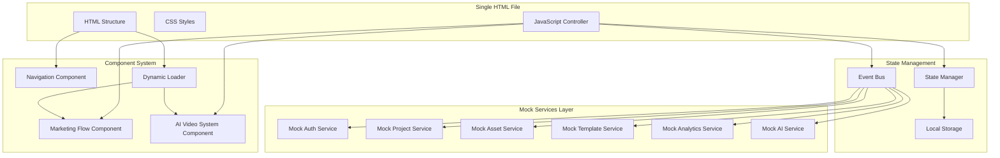

# Technical Architecture Plan: AI Video System to HTML/CSS/JS Conversion

## Executive Summary

This document outlines the technical architecture for converting the complex AI video system (Next.js + Express.js + AI Engine) into a pure HTML/CSS/JavaScript implementation that integrates seamlessly with the existing marketing operations flow. The solution maintains all UI functionality while using mock services to simulate backend operations, creating a comprehensive demonstration system within a single HTML file.

## 1. Component Architecture Design

### 1.1 High-Level Architecture



### 1.2 Component Breakdown

#### 1.2.1 Navigation Component
```javascript
class NavigationComponent {
    constructor(container, stateManager) {
        this.container = container;
        this.stateManager = stateManager;
        this.activeTab = 'marketing';
        this.tabs = [
            { id: 'marketing', name: 'Marketing Strategy', icon: 'strategy' },
            { id: 'ai-video', name: 'AI Video System', icon: 'video' }
        ];
    }
    
    render() {
        // Tab-based navigation with responsive design
        // Active state indicators
        // Smooth transitions
    }
    
    switchTab(tabId) {
        // Handle tab switching with loading states
        // Lazy load components
        // Update state
    }
}
```

#### 1.2.2 Marketing Flow Component
```javascript
class MarketingFlowComponent {
    constructor(container, stateManager) {
        this.container = container;
        this.stateManager = stateManager;
        this.flowchartData = null;
        this.interactiveElements = [];
    }
    
    async load() {
        // Load existing flowchart structure
        // Preserve all CSS animations and hover states
        // Maintain responsive design
    }
    
    render() {
        // Exact replica of current index.html design
        // All flowchart elements and connections
        // Interactive hover states and animations
    }
}
```

#### 1.2.3 AI Video System Component
```javascript
class AIVideoSystemComponent {
    constructor(container, stateManager) {
        this.container = container;
        this.stateManager = stateManager;
        this.currentView = 'dashboard';
        this.subComponents = {};
    }
    
    async load() {
        // Initialize sub-components on demand
        // Setup mock data
        // Configure event handlers
    }
    
    renderDashboard() {
        // Main dashboard with project management
        // Project cards with status indicators
        // Quick actions and navigation
    }
    
    renderVideoEditor() {
        // Timeline-based video editor interface
        // Asset library integration
        // Preview and controls
    }
}
```

## 2. Mock Service Design

### 2.1 Mock Service Architecture

```javascript
class MockServiceManager {
    constructor() {
        this.services = {
            auth: new MockAuthService(),
            projects: new MockProjectService(),
            assets: new MockAssetService(),
            templates: new MockTemplateService(),
            analytics: new MockAnalyticsService(),
            ai: new MockAIService()
        };
        this.responseDelay = 500; // Simulate network latency
    }
    
    async call(service, method, ...args) {
        // Simulate API call with delay
        await this.delay(this.responseDelay);
        return await this.services[service][method](...args);
    }
    
    delay(ms) {
        return new Promise(resolve => setTimeout(resolve, ms));
    }
}
```

### 2.2 Authentication Mock Service

```javascript
class MockAuthService {
    constructor() {
        this.users = this.generateMockUsers();
        this.currentUser = null;
        this.tokens = new Map();
    }
    
    generateMockUsers() {
        return [
            {
                id: 'user_1',
                email: 'demo@marketingforge.com',
                name: 'Demo User',
                password: 'demo123',
                subscriptionTier: 'pro',
                creditsRemaining: 100,
                isVerified: true
            },
            {
                id: 'user_2',
                email: 'admin@marketingforge.com',
                name: 'Admin User',
                password: 'admin123',
                subscriptionTier: 'enterprise',
                creditsRemaining: 1000,
                isVerified: true
            }
        ];
    }
    
    async login(email, password) {
        const user = this.users.find(u => u.email === email && u.password === password);
        if (!user) {
            throw new Error('Invalid credentials');
        }
        
        const token = this.generateToken(user.id);
        this.tokens.set(token, user);
        this.currentUser = user;
        
        return {
            status: 'success',
            data: {
                user: this.sanitizeUser(user),
                token
            }
        };
    }
    
    async register(userData) {
        // Simulate user registration
        const newUser = {
            id: `user_${Date.now()}`,
            ...userData,
            subscriptionTier: 'free',
            creditsRemaining: 10,
            isVerified: false
        };
        
        this.users.push(newUser);
        const token = this.generateToken(newUser.id);
        this.tokens.set(token, newUser);
        
        return {
            status: 'success',
            data: {
                user: this.sanitizeUser(newUser),
                token
            }
        };
    }
    
    generateToken(userId) {
        return `mock_token_${userId}_${Date.now()}`;
    }
    
    sanitizeUser(user) {
        const { password, ...sanitized } = user;
        return sanitized;
    }
}
```

### 2.3 Project Management Mock Service

```javascript
class MockProjectService {
    constructor() {
        this.projects = this.generateMockProjects();
        this.collaborations = new Map();
    }
    
    generateMockProjects() {
        return [
            {
                id: 'proj_1',
                title: 'Product Launch Video',
                description: 'Marketing video for new product launch',
                status: 'completed',
                thumbnailUrl: 'https://picsum.photos/seed/project1/300/200.jpg',
                settings: {
                    duration: 60,
                    quality: '1080p',
                    format: 'mp4'
                },
                metadata: {
                    tags: ['marketing', 'product', 'launch'],
                    category: 'commercial'
                },
                createdAt: new Date('2024-01-15'),
                updatedAt: new Date('2024-01-20'),
                userId: 'user_1'
            },
            {
                id: 'proj_2',
                title: 'Social Media Campaign',
                description: 'Short-form videos for social platforms',
                status: 'processing',
                thumbnailUrl: 'https://picsum.photos/seed/project2/300/200.jpg',
                settings: {
                    duration: 30,
                    quality: '720p',
                    format: 'mp4'
                },
                metadata: {
                    tags: ['social', 'campaign', 'shorts'],
                    category: 'social-media'
                },
                createdAt: new Date('2024-01-18'),
                updatedAt: new Date('2024-01-22'),
                userId: 'user_1'
            }
        ];
    }
    
    async getProjects(userId, filters = {}) {
        let filteredProjects = this.projects.filter(p => p.userId === userId);
        
        if (filters.status) {
            filteredProjects = filteredProjects.filter(p => p.status === filters.status);
        }
        
        if (filters.search) {
            const searchTerm = filters.search.toLowerCase();
            filteredProjects = filteredProjects.filter(p => 
                p.title.toLowerCase().includes(searchTerm) ||
                p.description.toLowerCase().includes(searchTerm)
            );
        }
        
        // Add mock counts
        filteredProjects = filteredProjects.map(project => ({
            ...project,
            assetCount: Math.floor(Math.random() * 20) + 5,
            renderCount: Math.floor(Math.random() * 10) + 1,
            collaboratorCount: Math.floor(Math.random() * 3)
        }));
        
        return {
            status: 'success',
            data: {
                projects: filteredProjects,
                pagination: {
                    page: filters.page || 1,
                    limit: filters.limit || 10,
                    total: filteredProjects.length,
                    totalPages: Math.ceil(filteredProjects.length / (filters.limit || 10))
                }
            }
        };
    }
    
    async createProject(userId, projectData) {
        const newProject = {
            id: `proj_${Date.now()}`,
            ...projectData,
            status: 'draft',
            thumbnailUrl: `https://picsum.photos/seed/${Date.now()}/300/200.jpg`,
            metadata: projectData.metadata || {},
            createdAt: new Date(),
            updatedAt: new Date(),
            userId
        };
        
        this.projects.push(newProject);
        
        return {
            status: 'success',
            data: { project: newProject }
        };
    }
}
```

### 2.4 Asset Management Mock Service

```javascript
class MockAssetService {
    constructor() {
        this.assets = this.generateMockAssets();
    }
    
    generateMockAssets() {
        const assetTypes = ['image', 'video', 'audio'];
        const assets = [];
        
        for (let i = 1; i <= 50; i++) {
            const type = assetTypes[Math.floor(Math.random() * assetTypes.length)];
            assets.push({
                id: `asset_${i}`,
                type,
                name: `Sample ${type} ${i}`,
                url: `https://picsum.photos/seed/asset${i}/800/600.jpg`,
                fileSize: Math.floor(Math.random() * 10000000) + 1000000,
                dimensions: type === 'image' ? { width: 1920, height: 1080 } : null,
                duration: type === 'video' ? Math.floor(Math.random() * 300) + 30 : null,
                metadata: {
                    originalName: `sample_${type}_${i}.jpg`,
                    mimetype: type === 'image' ? 'image/jpeg' : type === 'video' ? 'video/mp4' : 'audio/mp3'
                },
                createdAt: new Date(Date.now() - Math.random() * 30 * 24 * 60 * 60 * 1000),
                projectId: `proj_${Math.floor(Math.random() * 5) + 1}`,
                userId: 'user_1'
            });
        }
        
        return assets;
    }
    
    async getAssets(userId, filters = {}) {
        let filteredAssets = this.assets.filter(a => a.userId === userId);
        
        if (filters.type) {
            filteredAssets = filteredAssets.filter(a => a.type === filters.type);
        }
        
        if (filters.projectId) {
            filteredAssets = filteredAssets.filter(a => a.projectId === filters.projectId);
        }
        
        if (filters.search) {
            const searchTerm = filters.search.toLowerCase();
            filteredAssets = filteredAssets.filter(a => 
                a.name.toLowerCase().includes(searchTerm)
            );
        }
        
        return {
            status: 'success',
            data: {
                assets: filteredAssets,
                pagination: {
                    page: filters.page || 1,
                    limit: filters.limit || 20,
                    total: filteredAssets.length,
                    totalPages: Math.ceil(filteredAssets.length / (filters.limit || 20))
                }
            }
        };
    }
}
```

### 2.5 Template System Mock Service

```javascript
class MockTemplateService {
    constructor() {
        this.templates = this.generateMockTemplates();
    }
    
    generateMockTemplates() {
        return [
            {
                id: 'template_1',
                name: 'Product Showcase',
                description: 'Elegant product presentation template',
                category: 'commercial',
                thumbnailUrl: 'https://picsum.photos/seed/template1/300/200.jpg',
                isPublic: true,
                usageCount: 245,
                createdBy: 'user_2',
                templateData: {
                    duration: 60,
                    scenes: [
                        { type: 'intro', duration: 5 },
                        { type: 'showcase', duration: 45 },
                        { type: 'outro', duration: 10 }
                    ],
                    style: 'modern',
                    colorScheme: 'blue'
                },
                createdAt: new Date('2024-01-10'),
                updatedAt: new Date('2024-01-15')
            },
            {
                id: 'template_2',
                name: 'Social Media Short',
                description: 'Optimized for social platforms',
                category: 'social-media',
                thumbnailUrl: 'https://picsum.photos/seed/template2/300/200.jpg',
                isPublic: true,
                usageCount: 189,
                createdBy: 'user_1',
                templateData: {
                    duration: 30,
                    scenes: [
                        { type: 'hook', duration: 3 },
                        { type: 'content', duration: 24 },
                        { type: 'cta', duration: 3 }
                    ],
                    style: 'trendy',
                    colorScheme: 'vibrant'
                },
                createdAt: new Date('2024-01-12'),
                updatedAt: new Date('2024-01-18')
            }
        ];
    }
    
    async getTemplates(filters = {}) {
        let filteredTemplates = this.templates;
        
        if (filters.category) {
            filteredTemplates = filteredTemplates.filter(t => t.category === filters.category);
        }
        
        if (filters.search) {
            const searchTerm = filters.search.toLowerCase();
            filteredTemplates = filteredTemplates.filter(t => 
                t.name.toLowerCase().includes(searchTerm) ||
                t.description.toLowerCase().includes(searchTerm)
            );
        }
        
        return {
            status: 'success',
            data: {
                templates: filteredTemplates,
                pagination: {
                    page: filters.page || 1,
                    limit: filters.limit || 20,
                    total: filteredTemplates.length,
                    totalPages: Math.ceil(filteredTemplates.length / (filters.limit || 20))
                }
            }
        };
    }
}
```

### 2.6 Analytics Mock Service

```javascript
class MockAnalyticsService {
    constructor() {
        this.analyticsData = this.generateMockAnalytics();
    }
    
    generateMockAnalytics() {
        const events = [];
        const eventTypes = ['user_login', 'project_created', 'video_generated', 'asset_uploaded', 'export_completed'];
        
        // Generate 30 days of mock data
        for (let i = 0; i < 30; i++) {
            const date = new Date();
            date.setDate(date.getDate() - i);
            
            for (let j = 0; j < Math.floor(Math.random() * 10) + 1; j++) {
                events.push({
                    id: `event_${Date.now()}_${i}_${j}`,
                    eventType: eventTypes[Math.floor(Math.random() * eventTypes.length)],
                    timestamp: new Date(date.getTime() + Math.random() * 24 * 60 * 60 * 1000),
                    userId: 'user_1',
                    sessionId: `session_${Math.floor(Math.random() * 5) + 1}`,
                    eventData: {
                        source: 'web',
                        userAgent: 'Mozilla/5.0 (Windows NT 10.0; Win64; x64) AppleWebKit/537.36'
                    }
                });
            }
        }
        
        return events;
    }
    
    async getOverview(userId, days = 30) {
        const cutoffDate = new Date();
        cutoffDate.setDate(cutoffDate.getDate() - days);
        
        const recentEvents = this.analyticsData.filter(e => 
            e.userId === userId && e.timestamp > cutoffDate
        );
        
        const eventTypes = {};
        recentEvents.forEach(event => {
            eventTypes[event.eventType] = (eventTypes[event.eventType] || 0) + 1;
        });
        
        const dailyActivity = {};
        recentEvents.forEach(event => {
            const dateKey = event.timestamp.toISOString().split('T')[0];
            if (!dailyActivity[dateKey]) {
                dailyActivity[dateKey] = { events: 0, sessions: new Set() };
            }
            dailyActivity[dateKey].events++;
            dailyActivity[dateKey].sessions.add(event.sessionId);
        });
        
        return {
            status: 'success',
            data: {
                overview: {
                    summary: {
                        totalEvents: recentEvents.length,
                        activeDays: Object.keys(dailyActivity).length,
                        totalSessions: new Set(recentEvents.map(e => e.sessionId)).size,
                        firstEvent: recentEvents[0]?.timestamp,
                        lastEvent: recentEvents[recentEvents.length - 1]?.timestamp
                    },
                    eventTypes: Object.entries(eventTypes).map(([type, count]) => ({ eventType: type, count })),
                    dailyActivity: Object.entries(dailyActivity).map(([date, data]) => ({
                        date,
                        events: data.events,
                        sessions: data.sessions.size
                    }))
                }
            }
        };
    }
}
```

### 2.7 AI Processing Mock Service

```javascript
class MockAIService {
    constructor() {
        this.processingJobs = new Map();
        this.jobQueue = [];
    }
    
    async generateVideo(projectId, settings) {
        const jobId = `job_${Date.now()}`;
        
        // Create initial job record
        const job = {
            id: jobId,
            projectId,
            status: 'queued',
            progress: 0,
            settings,
            createdAt: new Date(),
            startedAt: null,
            completedAt: null,
            resultUrl: null,
            errorMessage: null
        };
        
        this.processingJobs.set(jobId, job);
        this.jobQueue.push(jobId);
        
        // Start processing simulation
        this.simulateProcessing(jobId);
        
        return {
            status: 'success',
            data: { job }
        };
    }
    
    async simulateProcessing(jobId) {
        const job = this.processingJobs.get(jobId);
        if (!job) return;
        
        // Update status to processing
        job.status = 'processing';
        job.startedAt = new Date();
        
        // Simulate processing steps
        const steps = [
            { name: 'Analyzing content', duration: 2000, progress: 20 },
            { name: 'Generating script', duration: 3000, progress: 40 },
            { name: 'Creating visuals', duration: 4000, progress: 60 },
            { name: 'Generating voiceover', duration: 3000, progress: 80 },
            { name: 'Composing video', duration: 2000, progress: 100 }
        ];
        
        for (const step of steps) {
            await this.delay(step.duration);
            job.progress = step.progress;
            job.currentStep = step.name;
        }
        
        // Complete job
        job.status = 'completed';
        job.completedAt = new Date();
        job.resultUrl = `https://picsum.photos/seed/video_${jobId}/1920/1080.jpg`;
        job.progress = 100;
        delete job.currentStep;
    }
    
    async getJobStatus(jobId) {
        const job = this.processingJobs.get(jobId);
        if (!job) {
            throw new Error('Job not found');
        }
        
        return {
            status: 'success',
            data: { job }
        };
    }
    
    delay(ms) {
        return new Promise(resolve => setTimeout(resolve, ms));
    }
}
```

## 3. State Management System

### 3.1 State Manager Architecture

```javascript
class StateManager {
    constructor() {
        this.state = {
            user: null,
            isAuthenticated: false,
            currentTab: 'marketing',
            aiVideo: {
                currentView: 'dashboard',
                currentProject: null,
                projects: [],
                assets: [],
                templates: [],
                processingJobs: []
            },
            marketing: {
                flowchartData: null,
                interactiveElements: []
            },
            ui: {
                loading: false,
                notifications: [],
                sidebarOpen: false,
                theme: 'light'
            }
        };
        
        this.subscribers = new Map();
        this.persistenceKeys = ['user', 'isAuthenticated', 'ui.theme'];
        
        this.loadFromStorage();
        this.setupAutoSave();
    }
    
    subscribe(key, callback) {
        if (!this.subscribers.has(key)) {
            this.subscribers.set(key, new Set());
        }
        this.subscribers.get(key).add(callback);
        
        // Return unsubscribe function
        return () => {
            this.subscribers.get(key).delete(callback);
        };
    }
    
    setState(updates, notify = true) {
        const prevState = { ...this.state };
        
        // Deep merge updates
        this.state = this.deepMerge(this.state, updates);
        
        // Save to localStorage if needed
        this.saveToStorage(updates);
        
        // Notify subscribers
        if (notify) {
            this.notifySubscribers(updates, prevState);
        }
    }
    
    getState(path = null) {
        if (!path) return this.state;
        
        return path.split('.').reduce((obj, key) => obj?.[key], this.state);
    }
    
    notifySubscribers(updates, prevState) {
        Object.keys(updates).forEach(key => {
            if (this.subscribers.has(key)) {
                this.subscribers.get(key).forEach(callback => {
                    callback(this.state[key], prevState[key]);
                });
            }
        });
    }
    
    deepMerge(target, source) {
        const result = { ...target };
        
        Object.keys(source).forEach(key => {
            if (source[key] && typeof source[key] === 'object' && !Array.isArray(source[key])) {
                result[key] = this.deepMerge(result[key] || {}, source[key]);
            } else {
                result[key] = source[key];
            }
        });
        
        return result;
    }
    
    saveToStorage(updates) {
        this.persistenceKeys.forEach(key => {
            if (this.hasNestedKey(updates, key)) {
                const value = this.getState(key);
                localStorage.setItem(`marketing_forge_${key}`, JSON.stringify(value));
            }
        });
    }
    
    loadFromStorage() {
        this.persistenceKeys.forEach(key => {
            const stored = localStorage.getItem(`marketing_forge_${key}`);
            if (stored) {
                try {
                    const value = JSON.parse(stored);
                    this.state = this.deepMerge(this.state, { [key]: value });
                } catch (error) {
                    console.warn(`Failed to load ${key} from storage:`, error);
                }
            }
        });
    }
    
    setupAutoSave() {
        // Auto-save every 30 seconds
        setInterval(() => {
            this.saveToStorage(this.state);
        }, 30000);
    }
    
    hasNestedKey(obj, keyPath) {
        return keyPath.split('.').some(key => key in obj);
    }
}
```

### 3.2 Event Bus System

```javascript
class EventBus {
    constructor() {
        this.events = new Map();
    }
    
    on(event, callback) {
        if (!this.events.has(event)) {
            this.events.set(event, new Set());
        }
        this.events.get(event).add(callback);
        
        // Return unsubscribe function
        return () => {
            this.events.get(event).delete(callback);
        };
    }
    
    emit(event, data) {
        if (this.events.has(event)) {
            this.events.get(event).forEach(callback => {
                try {
                    callback(data);
                } catch (error) {
                    console.error(`Error in event handler for ${event}:`, error);
                }
            });
        }
    }
    
    once(event, callback) {
        const onceCallback = (data) => {
            callback(data);
            this.off(event, onceCallback);
        };
        
        this.on(event, onceCallback);
    }
    
    off(event, callback) {
        if (this.events.has(event)) {
            this.events.get(event).delete(callback);
        }
    }
    
    clear() {
        this.events.clear();
    }
}
```

## 4. Integration with Marketing Operations Flow

### 4.1 Tab-Based Integration

```javascript
class UnifiedInterface {
    constructor() {
        this.stateManager = new StateManager();
        this.eventBus = new EventBus();
        this.mockServices = new MockServiceManager();
        this.navigation = null;
        this.marketingComponent = null;
        this.aiVideoComponent = null;
        this.componentLoader = null;
    }
    
    async initialize() {
        // Setup navigation
        this.setupNavigation();
        
        // Initialize component loader
        this.componentLoader = new ComponentLoader(this.stateManager, this.eventBus);
        
        // Load initial tab
        await this.loadTab(this.stateManager.getState('currentTab'));
        
        // Setup event listeners
        this.setupEventListeners();
    }
    
    setupNavigation() {
        const navContainer = document.getElementById('navigation');
        this.navigation = new NavigationComponent(navContainer, this.stateManager);
        this.navigation.render();
    }
    
    async loadTab(tabId) {
        this.stateManager.setState({ ui: { loading: true } });
        
        try {
            switch (tabId) {
                case 'marketing':
                    await this.loadMarketingFlow();
                    break;
                case 'ai-video':
                    await this.loadAIVideoSystem();
                    break;
            }
            
            this.stateManager.setState({ 
                currentTab: tabId,
                ui: { loading: false }
            });
        } catch (error) {
            console.error(`Failed to load tab ${tabId}:`, error);
            this.stateManager.setState({ 
                ui: { 
                    loading: false,
                    notifications: [{
                        type: 'error',
                        message: `Failed to load ${tabId}: ${error.message}`
                    }]
                }
            });
        }
    }
    
    async loadMarketingFlow() {
        const container = document.getElementById('main-content');
        
        if (!this.marketingComponent) {
            this.marketingComponent = await this.componentLoader.loadComponent(
                'marketing-flow',
                container
            );
        } else {
            this.marketingComponent.show();
        }
        
        // Hide AI video component if exists
        if (this.aiVideoComponent) {
            this.aiVideoComponent.hide();
        }
    }
    
    async loadAIVideoSystem() {
        const container = document.getElementById('main-content');
        
        if (!this.aiVideoComponent) {
            this.aiVideoComponent = await this.componentLoader.loadComponent(
                'ai-video-system',
                container
            );
        } else {
            this.aiVideoComponent.show();
        }
        
        // Hide marketing component if exists
        if (this.marketingComponent) {
            this.marketingComponent.hide();
        }
    }
    
    setupEventListeners() {
        // Tab switching
        this.eventBus.on('tab-switch', async (tabId) => {
            await this.loadTab(tabId);
        });
        
        // Authentication events
        this.eventBus.on('login', async (credentials) => {
            try {
                const response = await this.mockServices.call('auth', 'login', credentials.email, credentials.password);
                this.stateManager.setState({
                    user: response.data.user,
                    isAuthenticated: true
                });
                
                this.eventBus.emit('notification', {
                    type: 'success',
                    message: 'Login successful'
                });
            } catch (error) {
                this.eventBus.emit('notification', {
                    type: 'error',
                    message: error.message
                });
            }
        });
        
        // Project events
        this.eventBus.on('project-created', async (projectData) => {
            try {
                const response = await this.mockServices.call('projects', 'createProject', this.stateManager.getState('user.id'), projectData);
                const projects = [...this.stateManager.getState('aiVideo.projects'), response.data.project];
                this.stateManager.setState({
                    aiVideo: { projects }
                });
                
                this.eventBus.emit('notification', {
                    type: 'success',
                    message: 'Project created successfully'
                });
            } catch (error) {
                this.eventBus.emit('notification', {
                    type: 'error',
                    message: error.message
                });
            }
        });
    }
}
```

## 5. Dynamic Component Loading Strategy

### 5.1 Component Loader Implementation

```javascript
class ComponentLoader {
    constructor(stateManager, eventBus) {
        this.stateManager = stateManager;
        this.eventBus = eventBus;
        this.loadedComponents = new Map();
        this.loadingPromises = new Map();
    }
    
    async loadComponent(componentId, container) {
        // Return cached component if already loaded
        if (this.loadedComponents.has(componentId)) {
            return this.loadedComponents.get(componentId);
        }
        
        // Return existing promise if currently loading
        if (this.loadingPromises.has(componentId)) {
            return this.loadingPromises.get(componentId);
        }
        
        // Start loading process
        const loadingPromise = this.loadComponentInternal(componentId, container);
        this.loadingPromises.set(componentId, loadingPromise);
        
        try {
            const component = await loadingPromise;
            this.loadedComponents.set(componentId, component);
            return component;
        } finally {
            this.loadingPromises.delete(componentId);
        }
    }
    
    async loadComponentInternal(componentId, container) {
        // Show loading indicator
        this.showLoadingIndicator(container);
        
        try {
            switch (componentId) {
                case 'marketing-flow':
                    return await this.loadMarketingFlowComponent(container);
                case 'ai-video-system':
                    return await this.loadAIVideoSystemComponent(container);
                case 'video-editor':
                    return await this.loadVideoEditorComponent(container);
                case 'asset-library':
                    return await this.loadAssetLibraryComponent(container);
                case 'template-gallery':
                    return await this.loadTemplateGalleryComponent(container);
                case 'analytics-dashboard':
                    return await this.loadAnalyticsDashboardComponent(container);
                default:
                    throw new Error(`Unknown component: ${componentId}`);
            }
        } finally {
            this.hideLoadingIndicator(container);
        }
    }
    
    async loadMarketingFlowComponent(container) {
        // Load marketing flow component
        const component = new MarketingFlowComponent(container, this.stateManager);
        await component.load();
        component.render();
        return component;
    }
    
    async loadAIVideoSystemComponent(container) {
        // Load AI video system component
        const component = new AIVideoSystemComponent(container, this.stateManager);
        await component.load();
        component.render();
        return component;
    }
    
    showLoadingIndicator(container) {
        const indicator = document.createElement('div');
        indicator.className = 'loading-indicator';
        indicator.innerHTML = `
            <div class="spinner"></div>
            <div class="loading-text">Loading...</div>
        `;
        container.appendChild(indicator);
    }
    
    hideLoadingIndicator(container) {
        const indicator = container.querySelector('.loading-indicator');
        if (indicator) {
            indicator.remove();
        }
    }
}
```

### 5.2 Lazy Loading with Code Splitting

```javascript
class LazyComponentLoader {
    constructor() {
        this.componentRegistry = new Map();
        this.loadedScripts = new Set();
    }
    
    registerComponent(componentId, config) {
        this.componentRegistry.set(componentId, {
            ...config,
            loaded: false,
            loading: false
        });
    }
    
    async loadComponent(componentId) {
        const config = this.componentRegistry.get(componentId);
        if (!config) {
            throw new Error(`Component ${componentId} not registered`);
        }
        
        if (config.loaded) {
            return config.componentClass;
        }
        
        if (config.loading) {
            return new Promise((resolve, reject) => {
                const checkLoaded = () => {
                    const updatedConfig = this.componentRegistry.get(componentId);
                    if (updatedConfig.loaded) {
                        resolve(updatedConfig.componentClass);
                    } else if (!updatedConfig.loading) {
                        reject(new Error(`Failed to load component ${componentId}`));
                    } else {
                        setTimeout(checkLoaded, 100);
                    }
                };
                checkLoaded();
            });
        }
        
        config.loading = true;
        
        try {
            // Load CSS if specified
            if (config.cssUrl && !this.loadedScripts.has(config.cssUrl)) {
                await this.loadCSS(config.cssUrl);
                this.loadedScripts.add(config.cssUrl);
            }
            
            // Load JavaScript if specified
            if (config.jsUrl && !this.loadedScripts.has(config.jsUrl)) {
                await this.loadScript(config.jsUrl);
                this.loadedScripts.add(config.jsUrl);
            }
            
            // Get component class from global scope
            const componentClass = window[config.globalName];
            if (!componentClass) {
                throw new Error(`Component class ${config.globalName} not found`);
            }
            
            config.loaded = true;
            config.loading = false;
            config.componentClass = componentClass;
            
            return componentClass;
        } catch (error) {
            config.loading = false;
            throw error;
        }
    }
    
    loadCSS(url) {
        return new Promise((resolve, reject) => {
            const link = document.createElement('link');
            link.rel = 'stylesheet';
            link.href = url;
            link.onload = resolve;
            link.onerror = reject;
            document.head.appendChild(link);
        });
    }
    
    loadScript(url) {
        return new Promise((resolve, reject) => {
            const script = document.createElement('script');
            script.src = url;
            script.onload = resolve;
            script.onerror = reject;
            document.head.appendChild(script);
        });
    }
}
```

## 6. Performance Optimization Techniques

### 6.1 Initial Load Optimization

```javascript
class PerformanceOptimizer {
    constructor() {
        this.criticalCSS = this.generateCriticalCSS();
        this.nonCriticalCSS = [];
        this.javascriptModules = [];
    }
    
    generateCriticalCSS() {
        return `
            /* Critical CSS for above-the-fold content */
            body { margin: 0; font-family: 'Source Sans Pro', sans-serif; }
            .navigation { position: fixed; top: 0; left: 0; right: 0; z-index: 1000; }
            .main-content { margin-top: 60px; }
            .loading-indicator { display: flex; justify-content: center; align-items: center; height: 200px; }
            .spinner { border: 4px solid #f3f3f3; border-top: 4px solid #1a73e8; border-radius: 50%; width: 40px; height: 40px; animation: spin 1s linear infinite; }
            @keyframes spin { 0% { transform: rotate(0deg); } 100% { transform: rotate(360deg); } }
        `;
    }
    
    optimizeInitialLoad() {
        // Inline critical CSS
        this.inlineCriticalCSS();
        
        // Preload important resources
        this.preloadResources();
        
        // Setup intersection observer for lazy loading
        this.setupLazyLoading();
        
        // Optimize images
        this.optimizeImages();
    }
    
    inlineCriticalCSS() {
        const style = document.createElement('style');
        style.textContent = this.criticalCSS;
        document.head.appendChild(style);
    }
    
    preloadResources() {
        const resources = [
            { href: 'https://fonts.googleapis.com/css2?family=Source+Sans+Pro:wght@400;600;700&display=swap', as: 'style' },
            { href: 'https://fonts.googleapis.com/icon?family=Material+Icons', as: 'style' }
        ];
        
        resources.forEach(resource => {
            const link = document.createElement('link');
            link.rel = 'preload';
            link.href = resource.href;
            link.as = resource.as;
            document.head.appendChild(link);
        });
    }
    
    setupLazyLoading() {
        const imageObserver = new IntersectionObserver((entries) => {
            entries.forEach(entry => {
                if (entry.isIntersecting) {
                    const img = entry.target;
                    img.src = img.dataset.src;
                    img.classList.remove('lazy');
                    imageObserver.unobserve(img);
                }
            });
        });
        
        document.querySelectorAll('img[data-src]').forEach(img => {
            imageObserver.observe(img);
        });
    }
    
    optimizeImages() {
        // Convert images to WebP if supported
        if (this.supportsWebP()) {
            document.querySelectorAll('img[data-webp]').forEach(img => {
                img.src = img.dataset.webp;
            });
        }
    }
    
    supportsWebP() {
        return document.createElement('canvas').toDataURL('image/webp').indexOf('data:image/webp') === 0;
    }
}
```

### 6.2 Runtime Performance Optimization

```javascript
class RuntimeOptimizer {
    constructor() {
        this.rafCallbacks = new Set();
        this.isTicking = false;
    }
    
    optimizeEventHandling() {
        // Use event delegation for dynamic content
        this.setupEventDelegation();
        
        // Throttle scroll events
        this.throttleScrollEvents();
        
        // Debounce resize events
        this.debounceResizeEvents();
    }
    
    setupEventDelegation() {
        document.addEventListener('click', (event) => {
            const target = event.target.closest('[data-action]');
            if (target) {
                const action = target.dataset.action;
                const data = target.dataset;
                this.handleAction(action, data, event);
            }
        });
    }
    
    throttleScrollEvents() {
        let ticking = false;
        
        window.addEventListener('scroll', () => {
            if (!ticking) {
                requestAnimationFrame(() => {
                    this.handleScroll();
                    ticking = false;
                });
                ticking = true;
            }
        });
    }
    
    debounceResizeEvents() {
        let resizeTimeout;
        
        window.addEventListener('resize', () => {
            clearTimeout(resizeTimeout);
            resizeTimeout = setTimeout(() => {
                this.handleResize();
            }, 250);
        });
    }
    
    scheduleRAFCallback(callback) {
        this.rafCallbacks.add(callback);
        
        if (!this.isTicking) {
            this.isTicking = true;
            requestAnimationFrame(this.runRAFCallbacks.bind(this));
        }
    }
    
    runRAFCallbacks() {
        this.rafCallbacks.forEach(callback => callback());
        this.rafCallbacks.clear();
        this.isTicking = false;
    }
    
    handleAction(action, data, event) {
        // Handle delegated actions
        switch (action) {
            case 'switch-tab':
                this.eventBus.emit('tab-switch', data.tab);
                break;
            case 'create-project':
                this.eventBus.emit('create-project', data);
                break;
            case 'upload-asset':
                this.eventBus.emit('upload-asset', data);
                break;
            // Add more actions as needed
        }
    }
}
```

### 6.3 Memory Management

```javascript
class MemoryManager {
    constructor() {
        this.componentCache = new Map();
        this.maxCacheSize = 10;
        this.cleanupInterval = 5 * 60 * 1000; // 5 minutes
    }
    
    setupMemoryManagement() {
        // Setup periodic cleanup
        setInterval(() => {
            this.cleanup();
        }, this.cleanupInterval);
        
        // Listen for page visibility changes
        document.addEventListener('visibilitychange', () => {
            if (document.hidden) {
                this.cleanup();
            }
        });
        
        // Listen for memory pressure
        if ('memory' in performance) {
            this.monitorMemoryUsage();
        }
    }
    
    cacheComponent(componentId, component) {
        // Remove oldest component if cache is full
        if (this.componentCache.size >= this.maxCacheSize) {
            const oldestKey = this.componentCache.keys().next().value;
            this.destroyComponent(this.componentCache.get(oldestKey));
            this.componentCache.delete(oldestKey);
        }
        
        this.componentCache.set(componentId, component);
    }
    
    cleanup() {
        // Clean up unused components
        this.componentCache.forEach((component, componentId) => {
            if (!component.isVisible()) {
                this.destroyComponent(component);
                this.componentCache.delete(componentId);
            }
        });
        
        // Clear event listeners
        this.clearEventListeners();
        
        // Force garbage collection if available
        if (window.gc) {
            window.gc();
        }
    }
    
    destroyComponent(component) {
        if (component.destroy) {
            component.destroy();
        }
        
        // Remove DOM elements
        if (component.container) {
            component.container.innerHTML = '';
        }
    }
    
    clearEventListeners() {
        // Clear unused event listeners
        // This is a simplified version - in practice, you'd track and remove specific listeners
        const elements = document.querySelectorAll('[data-destroy]');
        elements.forEach(element => {
            element.remove();
        });
    }
    
    monitorMemoryUsage() {
        setInterval(() => {
            const memory = performance.memory;
            const usedMemory = memory.usedJSHeapSize / 1024 / 1024;
            const totalMemory = memory.totalJSHeapSize / 1024 / 1024;
            
            if (usedMemory / totalMemory > 0.8) {
                console.warn('High memory usage detected, triggering cleanup');
                this.cleanup();
            }
        }, 30000); // Check every 30 seconds
    }
}
```

## 7. Implementation Strategy

### 7.1 Phase-Based Implementation

#### Phase 1: Foundation (Week 1-2)
1. **HTML Structure Setup**
   - Create base HTML template with navigation
   - Implement tab-based layout
   - Setup responsive design framework

2. **State Management Implementation**
   - Implement StateManager class
   - Create EventBus system
   - Setup localStorage persistence

3. **Mock Service Layer**
   - Create MockServiceManager
   - Implement basic auth mock
   - Setup project management mock

#### Phase 2: Marketing Flow Integration (Week 3)
1. **Marketing Component**
   - Preserve existing flowchart design
   - Implement interactive elements
   - Maintain responsive behavior

2. **Navigation System**
   - Implement tab switching
   - Add loading states
   - Setup smooth transitions

#### Phase 3: AI Video System UI (Week 4-5)
1. **Dashboard Implementation**
   - Project management interface
   - Quick actions and navigation
   - Status indicators

2. **Video Editor UI**
   - Timeline-based interface
   - Asset library integration
   - Preview and controls

3. **Mock Services**
   - Complete all mock services
   - Implement AI processing simulation
   - Add realistic delays and progress

#### Phase 4: Advanced Features (Week 6)
1. **Template System**
   - Template gallery interface
   - Template usage tracking
   - Template creation UI

2. **Analytics Dashboard**
   - Analytics visualization
   - Mock data generation
   - Interactive charts

3. **Asset Management**
   - Asset library interface
   - Upload simulation
   - Asset organization

#### Phase 5: Optimization & Polish (Week 7-8)
1. **Performance Optimization**
   - Implement lazy loading
   - Optimize bundle size
   - Memory management

2. **User Experience**
   - Micro-interactions
   - Loading states
   - Error handling

3. **Testing & Refinement**
   - Cross-browser testing
   - Mobile responsiveness
   - Performance testing

### 7.2 Code Organization

```javascript
// File structure within the single HTML file
const App = {
    // Core systems
    StateManager,
    EventBus,
    MockServiceManager,
    
    // Components
    Components: {
        Navigation,
        MarketingFlow,
        AIVideoSystem,
        VideoEditor,
        AssetLibrary,
        TemplateGallery,
        AnalyticsDashboard
    },
    
    // Services
    Services: {
        MockAuth,
        MockProjects,
        MockAssets,
        MockTemplates,
        MockAnalytics,
        MockAI
    },
    
    // Utilities
    Utils: {
        PerformanceOptimizer,
        RuntimeOptimizer,
        MemoryManager,
        ComponentLoader
    },
    
    // Main application
    async init() {
        // Initialize application
        const app = new UnifiedInterface();
        await app.initialize();
        return app;
    }
};

// Initialize when DOM is ready
document.addEventListener('DOMContentLoaded', () => {
    App.init().catch(error => {
        console.error('Failed to initialize application:', error);
    });
});
```

## 8. Security Considerations

### 8.1 Client-Side Security

```javascript
class SecurityManager {
    constructor() {
        this.xssPatterns = [
            /<script\b[^<]*(?:(?!<\/script>)<[^<]*)*<\/script>/gi,
            /javascript:/gi,
            /on\w+\s*=/gi
        ];
        
        this.setupSecurity();
    }
    
    setupSecurity() {
        // Sanitize user inputs
        this.setupInputSanitization();
        
        // Prevent XSS attacks
        this.setupXSSProtection();
        
        // Secure data storage
        this.setupSecureStorage();
    }
    
    sanitizeInput(input) {
        if (typeof input !== 'string') {
            return input;
        }
        
        let sanitized = input;
        
        // Remove XSS patterns
        this.xssPatterns.forEach(pattern => {
            sanitized = sanitized.replace(pattern, '');
        });
        
        // Escape HTML entities
        sanitized = sanitized
            .replace(/&/g, '&')
            .replace(/</g, '<')
            .replace(/>/g, '>')
            .replace(/"/g, '"')
            .replace(/'/g, '&#x27;');
        
        return sanitized;
    }
    
    setupInputSanitization() {
        // Intercept form submissions
        document.addEventListener('submit', (event) => {
            const form = event.target;
            const inputs = form.querySelectorAll('input, textarea');
            
            inputs.forEach(input => {
                if (input.value) {
                    input.value = this.sanitizeInput(input.value);
                }
            });
        });
    }
    
    setupXSSProtection() {
        // Content Security Policy headers would be set server-side
        // This is client-side protection
        const originalCreateElement = document.createElement;
        
        document.createElement = function(tagName) {
            const element = originalCreateElement.call(this, tagName);
            
            if (tagName.toLowerCase() === 'script') {
                // Prevent dynamic script injection
                element.type = 'text/plain';
            }
            
            return element;
        };
    }
    
    setupSecureStorage() {
        // Encrypt sensitive data in localStorage
        const originalSetItem = localStorage.setItem;
        const originalGetItem = localStorage.getItem;
        
        localStorage.setItem = function(key, value) {
            if (key.includes('token') || key.includes('password')) {
                value = btoa(value); // Simple encoding for demo
            }
            return originalSetItem.call(this, key, value);
        };
        
        localStorage.getItem = function(key) {
            let value = originalGetItem.call(this, key);
            if (key.includes('token') || key.includes('password')) {
                try {
                    value = atob(value);
                } catch (e) {
                    // Ignore decoding errors
                }
            }
            return value;
        };
    }
}
```

## 9. Testing Strategy

### 9.1 Unit Testing Framework

```javascript
class TestFramework {
    constructor() {
        this.tests = [];
        this.results = [];
    }
    
    test(name, testFunction) {
        this.tests.push({ name, testFunction });
    }
    
    async runTests() {
        console.log('Running tests...');
        
        for (const test of this.tests) {
            try {
                await test.testFunction();
                this.results.push({ name: test.name, status: 'passed' });
                console.log(`✓ ${test.name}`);
            } catch (error) {
                this.results.push({ name: test.name, status: 'failed', error: error.message });
                console.error(`✗ ${test.name}: ${error.message}`);
            }
        }
        
        this.printResults();
    }
    
    assert(condition, message) {
        if (!condition) {
            throw new Error(message || 'Assertion failed');
        }
    }
    
    assertEqual(actual, expected, message) {
        if (actual !== expected) {
            throw new Error(message || `Expected ${expected}, got ${actual}`);
        }
    }
    
    printResults() {
        const passed = this.results.filter(r => r.status === 'passed').length;
        const failed = this.results.filter(r => r.status === 'failed').length;
        
        console.log(`\nTest Results: ${passed} passed, ${failed} failed`);
        
        if (failed > 0) {
            console.log('\nFailed Tests:');
            this.results.filter(r => r.status === 'failed').forEach(test => {
                console.log(`- ${test.name}: ${test.error}`);
            });
        }
    }
}

// Example tests
const testFramework = new TestFramework();

testFramework.test('StateManager initialization', () => {
    const stateManager = new StateManager();
    testFramework.assert(stateManager !== null, 'StateManager should be initialized');
    testFramework.assertEqual(typeof stateManager.getState(), 'object', 'State should be an object');
});

testFramework.test('MockServiceManager authentication', async () => {
    const mockService = new MockServiceManager();
    const result = await mockService.call('auth', 'login', 'demo@marketingforge.com', 'demo123');
    testFramework.assertEqual(result.status, 'success', 'Login should succeed');
    testFramework.assert(result.data.user !== null, 'User data should be returned');
});
```

## 10. Deployment Considerations

### 10.1 Single File Deployment

```javascript
class DeploymentManager {
    constructor() {
        this.version = '1.0.0';
        this.buildTimestamp = new Date().toISOString();
    }
    
    prepareForDeployment() {
        // Minify CSS and JavaScript
        this.minifyAssets();
        
        // Optimize images
        this.optimizeImages();
        
        // Generate deployment manifest
        this.generateManifest();
        
        // Setup service worker for offline support
        this.setupServiceWorker();
    }
    
    minifyAssets() {
        // In a real implementation, you would use minification tools
        // For this demo, we'll simulate the process
        console.log('Minifying assets...');
    }
    
    optimizeImages() {
        // Convert images to WebP
        // Generate responsive image sets
        console.log('Optimizing images...');
    }
    
    generateManifest() {
        const manifest = {
            name: 'Marketing Forge - Unified System',
            short_name: 'Marketing Forge',
            version: this.version,
            buildTimestamp: this.buildTimestamp,
            description: 'Unified marketing operations and AI video system',
            start_url: '/',
            display: 'standalone',
            background_color: '#ffffff',
            theme_color: '#1a73e8',
            icons: [
                {
                    src: 'icon-192.png',
                    sizes: '192x192',
                    type: 'image/png'
                },
                {
                    src: 'icon-512.png',
                    sizes: '512x512',
                    type: 'image/png'
                }
            ]
        };
        
        // In a real implementation, you would save this as manifest.json
        console.log('Deployment manifest:', manifest);
    }
    
    setupServiceWorker() {
        const serviceWorkerCode = `
            const CACHE_NAME = 'marketing-forge-v${this.version}';
            const urlsToCache = [
                '/',
                '/index.html',
                'https://fonts.googleapis.com/css2?family=Source+Sans+Pro:wght@400;600;700&display=swap',
                'https://fonts.googleapis.com/icon?family=Material+Icons'
            ];
            
            self.addEventListener('install', (event) => {
                event.waitUntil(
                    caches.open(CACHE_NAME)
                        .then((cache) => cache.addAll(urlsToCache))
                );
            });
            
            self.addEventListener('fetch', (event) => {
                event.respondWith(
                    caches.match(event.request)
                        .then((response) => {
                            return response || fetch(event.request);
                        })
                );
            });
        `;
        
        // In a real implementation, you would save this as sw.js
        console.log('Service worker code generated');
    }
}
```

## 11. Conclusion

This technical architecture plan provides a comprehensive roadmap for converting the complex AI video system into a pure HTML/CSS/JavaScript implementation while maintaining full functionality and integrating seamlessly with the existing marketing operations flow.

### Key Success Factors

1. **Component-Based Architecture**: Modular design allows for maintainability and scalability
2. **Mock Service Layer**: Realistic simulation of all backend operations
3. **State Management**: Centralized state management with persistence
4. **Performance Optimization**: Lazy loading, caching, and memory management
5. **Security**: Client-side security measures to prevent common vulnerabilities
6. **Testing**: Comprehensive testing framework to ensure reliability

### Implementation Timeline

The phase-based approach allows for incremental development and testing, with each phase building upon the previous one. The total estimated timeline is 8 weeks, with the potential for parallel development of certain components.

### Future Enhancements

The architecture is designed to accommodate future enhancements such as:
- Real API integration
- Advanced collaboration features
- Enhanced AI capabilities
- Mobile app development
- Multi-language support

This architecture provides a solid foundation for creating a comprehensive, performant, and maintainable unified marketing and AI video system within a single HTML file.
