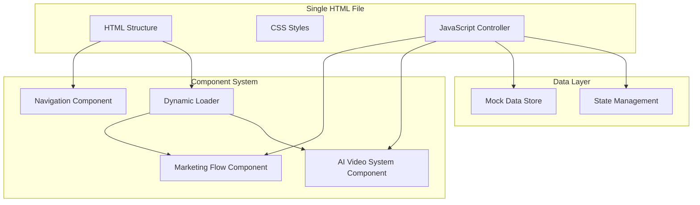

# Unified HTML-Only Marketing Operations Flow Specification

## Executive Summary

This specification outlines the conversion of two separate systems (marketing operations flow and AI video system) into a unified HTML-only interface. The solution will maintain the existing marketing operations visual design while integrating the AI video system as an additional tab, all within a single HTML file that dynamically loads components.

## User Stories

### User Story 1: Unified Interface Access
**As a** marketing team member  
**I want to** access both marketing operations flow and AI video system from a single interface  
**So that** I can seamlessly switch between strategic planning and content creation without context switching

**Acceptance Criteria:**
- Single HTML file loads all necessary components dynamically
- Tab-based navigation allows switching between marketing strategy and AI video system
- Current marketing operations visual design is preserved
- No backend dependencies required for basic functionality

### User Story 2: Marketing Strategy Visualization
**As a** marketing strategist  
**I want to** view the complete marketing operations flow with all existing visual elements  
**So that** I can understand and communicate our strategic approach effectively

**Acceptance Criteria:**
- All existing flowchart elements are preserved
- Interactive elements maintain hover states and transitions
- Content remains scrollable and responsive
- Strategic information is clearly displayed

### User Story 3: AI Video System UI Flow
**As a** content creator  
**I want to** navigate through the AI video system interface to understand the workflow  
**So that** I can see how video creation would work without actual processing

**Acceptance Criteria:**
- Complete UI flow from login through video creation process
- Mock data simulates system responses
- All form elements and interactions are present
- Progress indicators show simulated processing steps

### User Story 4: Dynamic Component Loading
**As a** user  
**I want to** have the interface load quickly and efficiently  
**So that** I can start working immediately without long wait times

**Acceptance Criteria:**
- Components load on-demand when tabs are activated
- Initial page load is optimized for performance
- Smooth transitions between tab switches
- No broken or missing elements during loading

## Success Criteria

### Functional Success Criteria
- Single HTML file contains complete unified interface
- Tab navigation works seamlessly between marketing strategy and AI video system
- All existing marketing operations visual elements are preserved
- AI video system UI flow is complete with mock interactions
- Dynamic component loading reduces initial load time
- Interface is fully responsive on mobile and desktop
- No backend dependencies for core functionality

### Technical Success Criteria
- HTML5 semantic structure with proper accessibility
- CSS3 animations and transitions preserved
- JavaScript handles all interactions without external dependencies
- Component-based architecture for maintainability
- Cross-browser compatibility (Chrome, Firefox, Safari, Edge)
- Performance metrics: <3s initial load, <500ms tab switches

### User Experience Success Criteria
- Intuitive navigation between systems
- Visual consistency across all tabs
- Clear indication of active system/tab
- Smooth transitions and micro-interactions
- Mobile-responsive design maintains usability

## System Architecture

### High-Level Architecture

### Component Architecture

#### Marketing Operations Component
- Preserves existing flowchart structure
- Maintains all CSS animations and hover states
- Responsive design for mobile viewing
- Interactive elements for strategic exploration

#### AI Video System Component
- Complete UI flow simulation
- Mock authentication system
- Simulated video creation pipeline
- Progress indicators and status updates

#### Navigation Component
- Tab-based interface design
- Active state indicators
- Smooth transition animations
- Mobile-responsive menu

#### Dynamic Loader
- Lazy loading of components
- Performance optimization
- Error handling for missing components
- Loading state indicators

## Technical Requirements

### HTML Structure
- Semantic HTML5 elements
- Proper ARIA labels for accessibility
- Meta tags for SEO and responsiveness
- Single file architecture with embedded resources

### CSS Requirements
- Preserve existing marketing flow styles
- Add AI video system styling
- Responsive design with mobile-first approach
- CSS Grid and Flexbox for layouts
- CSS animations and transitions
- Custom properties for theming

### JavaScript Requirements
- Component-based architecture
- State management for tab switching
- Mock data simulation
- Event handling for all interactions
- Performance optimization with lazy loading
- Error handling and fallbacks

### Browser Compatibility
- Modern browsers (Chrome 90+, Firefox 88+, Safari 14+, Edge 90+)
- Graceful degradation for older browsers
- Mobile browser support (iOS Safari, Android Chrome)

## User Interface Design

### Navigation Design
- Top navigation bar with tab system
- "Marketing Strategy" tab as default/primary
- "AI Video System" tab as secondary option
- Active tab highlighting with smooth transitions
- Mobile hamburger menu for small screens

### Marketing Operations Tab
- Exact replica of current index.html design
- All flowchart elements and connections
- Interactive hover states and animations
- Scrollable content area
- Responsive breakpoints maintained

### AI Video System Tab
- Login/Register interface simulation
- Dashboard with project management
- Video creation workflow UI
- Template selection interface
- Analytics dashboard mockup
- Settings and profile sections

## Mock Data Strategy

### Authentication Mock
- Pre-configured user accounts for demonstration
- Simulated login flow with validation
- Session management in browser storage
- Role-based access simulation

### Video Creation Mock
- Sample project data
- Simulated AI processing steps
- Progress indicators with realistic timing
- Mock video output placeholders
- Template library with examples

### Analytics Mock
- Sample performance metrics
- Chart data visualization
- Usage statistics
- Trend analysis examples

## Performance Considerations

### Initial Load Optimization
- Critical CSS inlined
- Non-critical CSS loaded asynchronously
- JavaScript modules loaded on demand
- Image optimization and lazy loading

### Runtime Performance
- Efficient DOM manipulation
- Event delegation for dynamic content
- Memory management for component switching
- Smooth 60fps animations

### Mobile Performance
- Touch-optimized interactions
- Reduced motion for battery saving
- Optimized asset sizes
- Progressive enhancement approach

## Accessibility Requirements

### WCAG 2.1 AA Compliance
- Semantic HTML structure
- Proper heading hierarchy
- ARIA labels and roles
- Keyboard navigation support
- Screen reader compatibility
- Color contrast requirements

### Accessibility Features
- Focus indicators for interactive elements
- Skip navigation links
- Alt text for all images
- Descriptive link text
- Form validation with clear error messages

## Security Considerations

### Client-Side Security
- Input sanitization for forms
- XSS prevention in dynamic content
- Secure data storage practices
- Content Security Policy headers

### Data Privacy
- No personal data collection
- Local storage for demo data only
- Clear privacy indicators
- Optional data reset functionality

## Testing Strategy

### Functional Testing
- Tab navigation functionality
- Component loading and unloading
- Form interactions and validation
- Mock data simulation accuracy
- Responsive design breakpoints

### Performance Testing
- Initial load time measurement
- Tab switching performance
- Memory usage monitoring
- Mobile device performance

### Accessibility Testing
- Screen reader compatibility
- Keyboard navigation flow
- Color contrast validation
- Touch target sizes

### Cross-Browser Testing
- Chrome, Firefox, Safari, Edge compatibility
- Mobile browser testing
- Progressive enhancement verification

## Deployment Requirements

### Static Hosting
- Single HTML file deployment
- No server-side processing required
- CDN-friendly architecture
- Offline capability considerations

### Browser Caching
- Appropriate cache headers
- Version management for updates
- Service worker for offline support
- Cache busting strategy

## Future Enhancements

### Potential Extensions
- Real AI API integration
- Data persistence layer
- Multi-user collaboration
- Advanced analytics tracking
- Export functionality

### Scalability Considerations
- Component modularity for easy expansion
- Plugin architecture for new features
- API integration points
- Theme customization system

## Constraints and Assumptions

### Technical Constraints
- Single HTML file limitation
- No backend processing
- Browser storage limitations
- Cross-origin API restrictions

### Business Constraints
- Marketing design must be preserved
- No actual AI processing required
- Demo-only functionality acceptable
- Rapid development timeline

### Assumptions
- Users have modern browsers
- Internet connection is available
- JavaScript is enabled
- Local storage is available

## Risk Assessment

### Technical Risks
- Browser compatibility issues
- Performance degradation with complex animations
- Memory limitations on mobile devices
- Component loading failures

### Mitigation Strategies
- Progressive enhancement approach
- Performance monitoring
- Fallback mechanisms
- Comprehensive testing

## Success Metrics

### User Engagement
- Time spent on each tab
- Feature interaction rates
- Navigation pattern analysis
- User satisfaction scores

### Technical Performance
- Page load times
- Tab switching speed
- Error rates
- Mobile performance scores

### Business Impact
- Demonstration effectiveness
- Stakeholder satisfaction
- Development timeline adherence
- Maintenance requirements